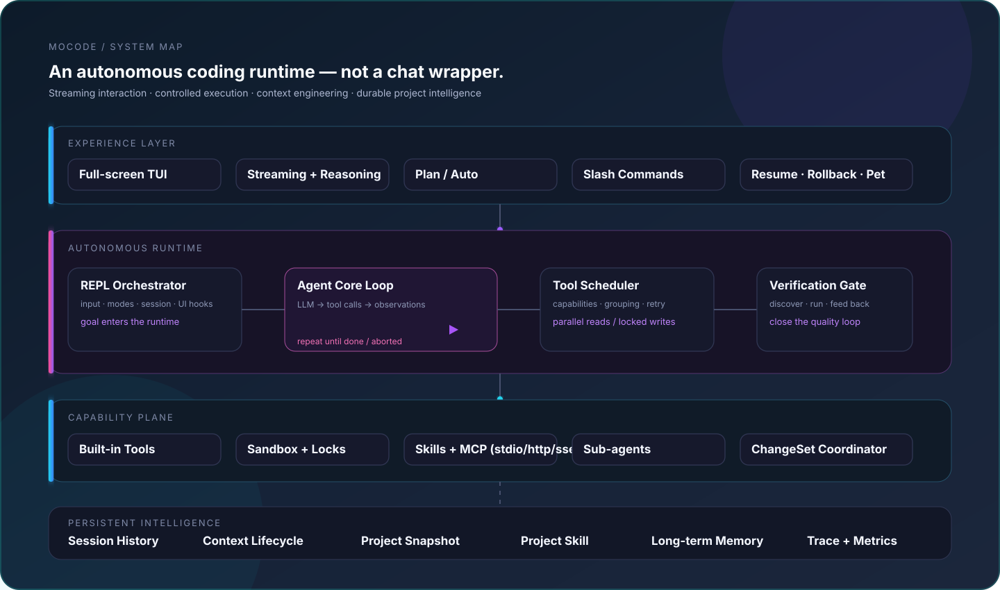
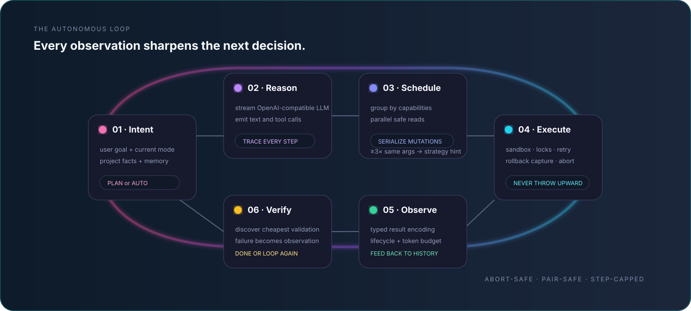
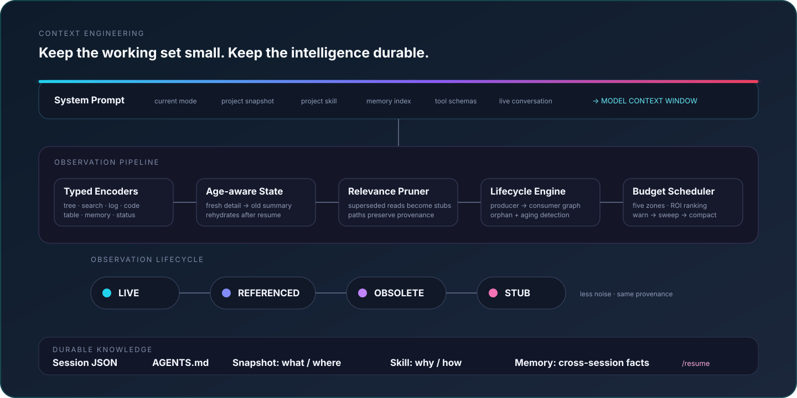
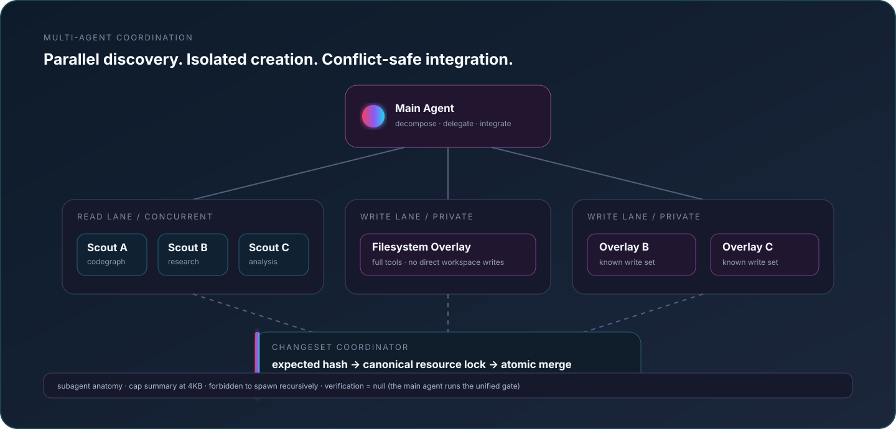
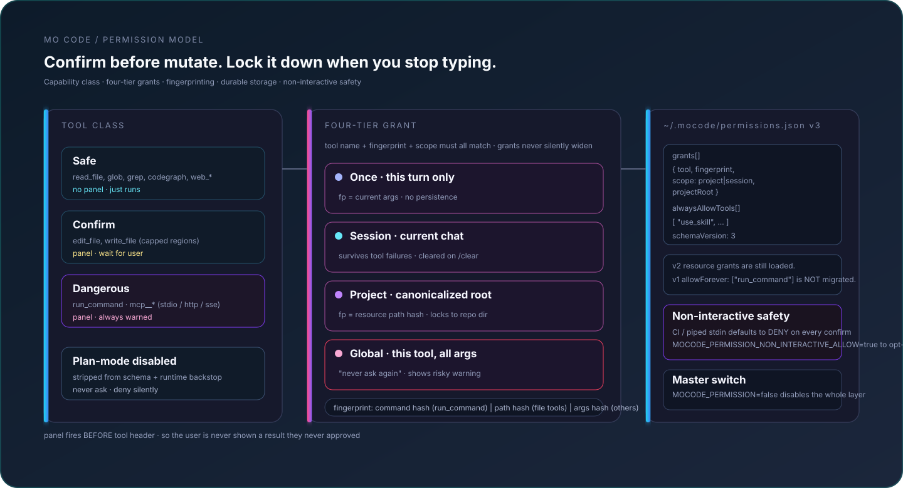
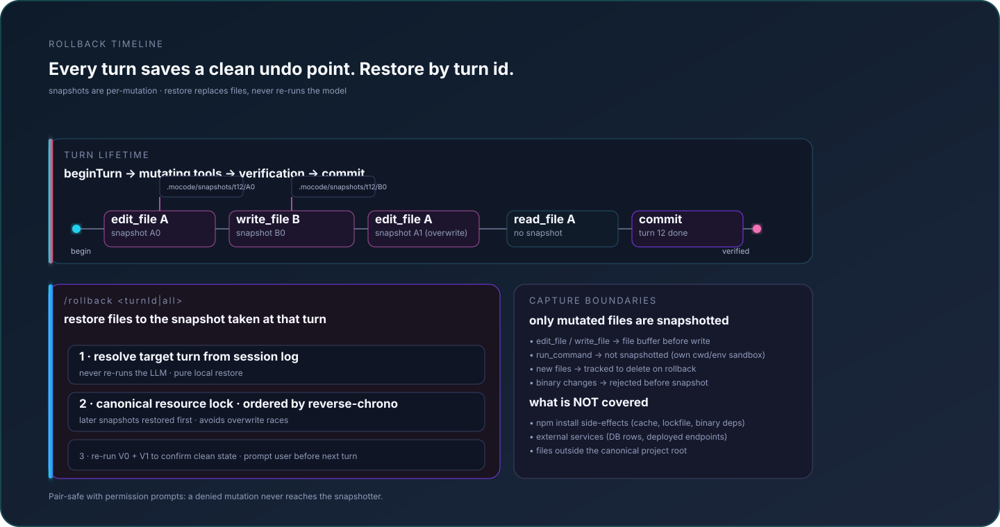
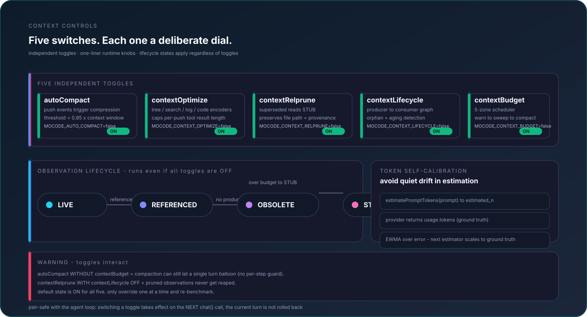
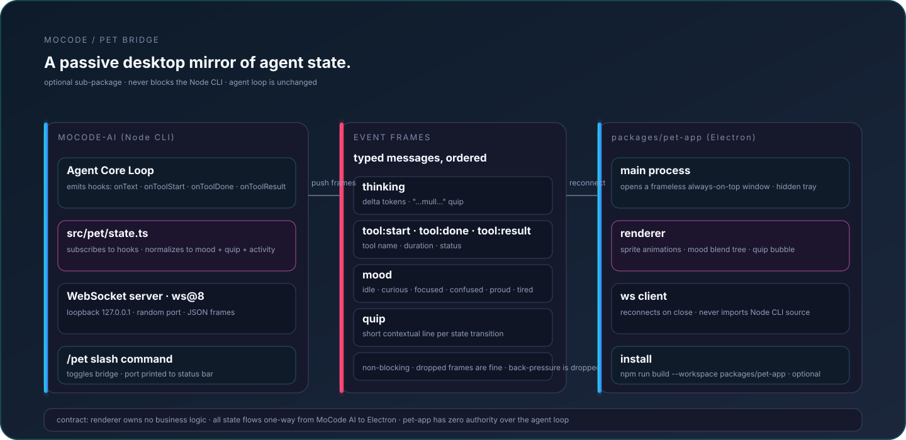

<p align="right">English | <a href="./README.zh-CN.md">简体中文</a></p>

# MoCode

A terminal coding agent: give it a goal, and it **completes it autonomously** — no step-by-step hand-holding required.

MoCode explores your code, reads/writes/edits files, runs shell commands, and searches the web on its own, driving the task forward through a loop of "think → call a tool → observe the result → think again." It works with any OpenAI-compatible endpoint (GLM, DeepSeek, Qwen, local Ollama / vLLM, etc.), runs as a full-screen TUI with streaming output and visible reasoning.

## Engineering discipline

MoCode keeps code-level control light and leaves task strategy to the agent:

- **Advisory working discipline** — The system prompt asks the agent to make focused changes, avoid redundant retrieval, and decide for itself whether validation is useful. Validation is optional and is never a completion gate.
- **Transparent tool failures** — Each tool call runs once and returns its raw structured failure to the agent, which decides whether and how to recover.
- **`ask_human` for user-owned decisions** — The agent asks only when repository evidence cannot resolve a high-impact choice; implementation details remain autonomous.
- **Five-zone context controls + token self-calibration** — Five independent dials (`autoCompact` / `contextOptimize` / `contextRelprune` / `contextLifecycle` / `contextBudget`) manage context pressure. Token estimation self-calibrates against provider usage.

## Architecture

MoCode is organized as a layered runtime: the terminal experience drives an autonomous core, the core reaches capabilities through a guarded execution plane, and a persistent intelligence layer keeps long-running work coherent.

<p align="center"></p>

### Autonomous execution loop

Each model response is one step in a closed loop. Tool calls are classified by declared capabilities, safe reads can run in parallel, and writes acquire canonical resource locks. Tool evidence returns to history unchanged apart from a hard per-result safety cap. When the agent has no more tools to call, its response completes immediately; the framework does not run hidden validation or force another model turn.

<p align="center"></p>

### Context compression only under real pressure

Normal sessions retain full tool evidence and structured freshness/provenance metadata. At 80% of the model window, one scheduler event runs enabled exact-supersession, stale-artifact, and old-log/search cleanup, then always compacts history. Lifecycle tracking never ages content by tool-call count.

<p align="center"></p>

### Multi-agent work without unsafe shared writes

Read-only sub-agents fan out concurrently. Writer agents work inside private filesystem overlays and return structured ChangeSets; the coordinator checks expected hashes, acquires canonical locks, and performs conflict-safe merges. Validation remains an explicit agent choice in the shared workspace.

<p align="center"></p>

### Controlled execution: permission gates and capability scheduling

Every mutating tool calls into a permission layer before it runs. Tools are classified `safe` / `confirm` / `dangerous`, scopes can be `once` / `session` / `project` / global-tool, fingerprints are stable hashes (command, path, or args), and the persistent record lives in `~/.mocode/permissions.json` (v3 schema, with v2 resource grants still loaded). Piped or CI environments default to deny until you opt in.

<p align="center"></p>

### Agent-directed validation

MoCode does not run a hidden validation cascade when a task ends. The agent can explicitly call `run_command` for a focused test, typecheck, or build when it judges that evidence useful; otherwise it may finish without an extra framework-controlled round trip.

### Rollback timeline: per-mutation snapshots, restore by turn

A clean undo point is saved before every mutating tool. `/rollback <turnId>` restores file buffers in reverse-chronological order under canonical resource locks — it does not re-run the model or launch automatic tests. Read tools, network effects, and binary changes are explicitly out of scope, kept honest in the contract.

<p align="center"></p>

### Context controls: one pressure gate, independently optional stages

The controls remain independently configurable, but automatic rewriting has exactly one trigger: corrected or raw request occupancy reaching 80%. That event runs every enabled pressure cleanup and then always compacts history. `contextLifecycle` only tracks provenance metadata, while EWMA calibration keeps the estimate aligned with provider usage.

<p align="center"></p>

### Desktop pet: a passive mirror over WebSocket

The optional Electron sub-package (`packages/pet-app`) shows a stateful floating character that mirrors agent activity via a one-way WebSocket stream. Quit with `/pet quit`. The renderer owns no business logic; the agent loop is unchanged regardless of whether the pet is running.

<p align="center"></p>

## Why MoCode

MoCode isn't a chat box with a coat of paint — it's an agent that actually gets things done:

- **Autonomous multi-step execution** — In a single conversation, the agent chains multiple steps on its own: read code, edit code, run tests, fix based on errors, and so on. It decides the next step without you nagging it. When it hits a decision point, it calls `ask_human` to pop up a panel and ask you (blocking until you respond).
- **Parallel read-only tools** — Consecutive read-only operations in a turn (reading files, grep, glob, codegraph, web search/fetch) run concurrently, so total time is roughly the slowest single call instead of the sum of all of them. Operations with side effects (writing/editing files) stay sequential to preserve snapshot ordering and data safety.
- **Sub-agents divide and conquer** — Complex tasks can spawn independent sub-agents with isolated histories and scoped toolsets. Read-only workers can fan out concurrently; writer workers run in private filesystem overlays and return ChangeSets that are merged under expected-hash checks and canonical resource locks. Only structured findings return to the main thread.
- **Plan / Auto dual mode** — In `plan` mode the agent is read-only (reads code, queries indexes, searches — never writes to disk, runs commands, or spawns sub-agents) and produces a plan; `auto` mode permits execution. Tool capabilities are not a static “full” mode: a lightweight LLM router selects the minimum sufficient groups for each real user turn, and the main model may add groups on a later step when needed.
- **Pressure-driven context compression** — Normal history keeps full tool evidence. At 80% occupancy, one scheduler event runs all enabled cleanup and always follows with a history summary. `/context` shows live usage and `/compact` remains an explicit manual override.
- **Cross-session long-term memory** — The agent can save project architecture, conventions, and lessons learned as long-term memory, auto-loaded in future sessions. A background process periodically reflects on conversations to mine things worth remembering. Memories can be created, searched, updated, and forgotten, with recall-based decay.
- **Project context (`AGENTS.md`)** — A single project-level memory file at `AGENTS.md` captures both static facts (project description, commands, module list, directory tree) and human/AI-written insights (conventions, architectural decisions, pitfalls). Generate it once with `/init`, then keep it up to date by hand or by asking the agent to refresh it. Loaded automatically into the system prompt on every turn.
- **Session notepad (notes.md)** — For complex multi-step tasks (≥3 file changes / ≥5 tool calls), the agent maintains a working notepad at `.mocode/sessions/<sessionId>/notes.md` (file-based, survives context compression). It records the execution plan with the dedicated `plan_update` tool — a three-state step machine (`pending`/`in_progress`/`completed`, at most one `in_progress`) that auto-settles to `## Done:` when finished. The active plan is re-injected into the system prompt after compaction and re-synced into context whenever notes.md changes, and a gentle reminder nudges the agent if it goes several tool-steps without updating the plan. A live progress chip in the TUI status bar shows `plan: [title] (3/7) ▸ [current step]`.
- **Interruptible and reversible** — Ctrl+C interrupts the current turn at any time (kills child processes recursively, rolls history back to before the turn started, leaves no half-finished tool calls). `/rollback` restores file changes from per-turn snapshots, with a per-file keep/undo choice — no git dependency required.
- **Input safety net** — Long prompts no longer fear a stray Enter: `Ctrl+G` opens an in-TUI composer popup (notepad-style editing — Enter inserts a newline, with soft wrap, selection, copy/cut/paste and undo; Ctrl+S fills the text back into the input box without sending). `Ctrl+R`/`Ctrl+P` fuzzy-search your input history (Enter only fills it back), and the post-send recall window widens to 2 seconds with any-key recall for long inputs.
- **Sandbox protection** — File reads/writes go through a sandbox that blocks out-of-bounds paths (`../../`, absolute paths outside the root, symlink escapes, etc.), so the agent never touches files outside your working directory.
- **Computer Use (high-risk, routed only for explicit GUI intent)** — When the request genuinely requires real mouse/keyboard interaction, the router can expose the `computer-control` group and feed each resulting screenshot back to the model. `/cu off` (or `MOCODE_COMPUTER_USE_ENABLED=false`) is a hard veto; `/cu on` merely allows routing and does not keep the tool permanently visible. The blast radius exceeds file tools because OS input bypasses the file sandbox. **Use a VM / sandbox / dedicated test machine**, not a daily driver. Every action still passes the permission gate, and plan mode always blocks it. Windows first; macOS/Linux pending.

## Features

- **Streaming output + visible reasoning** — Responses render as they're generated; when the model supports reasoning, the thinking process is visible in real time and auto-collapses to save screen space.
- **Full-screen TUI** — Alt-screen mode with a fixed status bar, scrollback (PgUp/PgDn), typeahead while the agent is running, and auto-prefill for the next turn.
- **Session persistence** — Every turn is saved automatically; `--resume` / `/resume` picks up a past session.
- **Skills system** — Scans directories like `~/.mocode/skills/` automatically; each skill's description is injected into the system prompt, and the model calls `use_skill` to load the full instructions only when relevant (progressive disclosure: skim the summary first, load the body only if needed).
- **Optional desktop pet** — A small floating window (`/pet`) shows a stateful character that mirrors agent activity (idle / thinking / tool running / waiting for human). Works as a separate process over WebSocket; quit it with `/pet quit`. Sits beside the terminal, never blocks it.
- **Slash commands** — `/exit` `/clear` `/context` `/skills` `/compact` `/resume` `/rollback` `/memory` `/reflect` `/init` `/theme` `/model` `/plan` `/auto` `/pet`, with dropdown filtering as you type.

## Documentation

- [中文使用指南](./docs/usage.md) — 菜单式快速上手、命令速查、模式、会话、项目上下文与排障。
- [Project context](./docs/usage.md#项目上下文) — `AGENTS.md` and Skills.

## Installation

Requires Node.js ≥ 18.

```bash
npm install -g mocode-ai
```

This gives you the `mocode` command. Prefer not to install globally? Run it directly with `npx mocode-ai`.

> MoCode checks for new versions on startup and self-updates in the background via `npm i -g mocode-ai@latest` — the update takes effect on the next launch, with zero startup delay and silent failure if offline. This is skipped in dev mode (`npm start`, running via tsx).

### Run from source (development / contributing)

```bash
git clone https://github.com/wanxunyang/mocode.git
cd mocode
npm install
npm start
```

Source runs directly via tsx, no build step. After changing code, restart `npm start` for changes to take effect (tsx loads modules at startup, no hot reload). Runtime dependencies: `openai`, `dotenv`, `fast-glob`; dev dependencies: `tsx`, `typescript`, `@types/node`.

## Configuration

On first use, run the setup wizard to fill in three fields interactively (API base URL / key / model name), written to `~/.mocode/config` (global, works from any directory or terminal):

```bash
mocode config
```

You can also configure it from inside the REPL with the `/model` command (pick a backend preset interactively and fill in each field, applied immediately and persisted). Without configuration, the REPL still opens and prompts you to run `/model`.

You can also hand-edit the config files. MoCode loads them in the following priority order (later entries override earlier ones, only backfilling unset environment variables; anything `export`ed in your shell always takes precedence):

1. `<cwd>/.env` — legacy compatibility, lowest priority (see `.env.example` in the source repo for reference)
2. `~/.mocode/config` — global (written by `/model` and `mocode config`)
3. `<cwd>/.mocode/config` — project-level override, highest priority

Three required fields:

```env
LLM_BASE_URL=https://open.bigmodel.cn/api/v3   # swap in your backend
LLM_API_KEY=your-key-here
LLM_MODEL=glm-4.6                              # swap in your model name
```

Common backend `base_url` values:

| Backend        | base_url                                            |
| -------------- | --------------------------------------------------- |
| GLM (Zhipu)    | `https://open.bigmodel.cn/api/v3`                   |
| DeepSeek       | `https://api.deepseek.com`                          |
| Qwen (Alibaba) | `https://dashscope.aliyuncs.com/compatible-mode/v1` |
| Local Ollama   | `http://localhost:11434/v1`                         |
| Local vLLM     | `http://localhost:8000/v1`                          |

> The model must support OpenAI-style function calling, otherwise tools won't be triggered.

### Optional configuration

| Environment variable            | Description                                                                                   | Default                     |
| ------------------------------- | --------------------------------------------------------------------------------------------- | --------------------------- |
| `MAX_TOKENS`                    | Max tokens per response                                                                       | unlimited                   |
| `CONTEXT_WINDOW_TOKENS`         | Model context window; must match the real model                                               | `256000`                    |
| `LLM_STREAM_USAGE`              | Include `stream_options.include_usage` on streaming requests for real usage                   | `true`                      |
| `AUTO_COMPACT`                  | Final history-compaction safety fallback                                                      | `true`                      |
| `AUTO_REFLECT`                  | Background reflection pass (opt-in; periodically mines memories from conversations)           | `false`                     |
| `REFLECT_EVERY_N`               | Trigger a background reflection every N turns (runs alongside the agent, non-blocking)        | `5`                         |
| `ANYSEARCH_API_KEY`             | Web search API key (falls back to anonymous free quota if unset)                              | none                        |
| `ANYSEARCH_BASE_URL`            | Search API endpoint                                                                           | `https://api.anysearch.com` |
| `SKILLS_DIRS`                   | Override the default skill scan directories (platform path separator)                         | three default directories   |
| `MOCODE_CONTEXT_OPTIMIZE`       | Opt-in typed encoding of Cold logs/searches, only under real pressure                         | `false`                     |
| `MOCODE_CONTEXT_RELPRUNE`       | Opt-in exact superseded-evidence pruning, only under real pressure                            | `false`                     |
| `MOCODE_LIFECYCLE`              | Provenance metadata tracking; never ages or rewrites content                                  | `true`                      |
| `MAX_STEPS`                     | Max agent loop steps per turn (infinite-loop safety only)                                     | `1000`                      |
| `SUB_AGENT_MAX_STEPS`           | Sub-agent loop safety ceiling; defaults to the main-agent value                               | `1000`                      |
| `SANDBOX_ROOT`                  | Sandbox root directory (file operation boundary; falls back to cwd if unset)                  | none                        |
| `MOCODE_SUBAGENT_ENABLED`       | Set `false` to veto the `orchestration` route group; unset/`true` allows on-demand routing    | unset                       |
| `MOCODE_FRONTEND_TOOLS_ENABLED` | Set `false` to veto `browser-debug` and `desktop-observe`; unset/`true` allows routing        | unset                       |
| `MOCODE_COMPUTER_USE_ENABLED`   | Set `false` to veto high-risk `computer-control`; unset/`true` allows explicit-intent routing | unset                       |
| `MEMORY_ENABLED`                | Set `false` to veto memory groups; `true` also enables the Memory Index                       | unset                       |
| `MOCODE_THEME`                  | Color theme (default/dark/light…; shell env takes precedence over file)                       | `default`                   |

## Usage

```bash
mocode                          # new session (run inside your target project directory)
mocode --resume                 # list saved sessions
mocode --resume <id>            # resume a specific session
mocode config                   # edit configuration
```

Running from source uses `npm start` (equivalent to `mocode`, but skips the self-update check).

Once in the REPL, just start chatting. It launches straight into the full-screen TUI, showing a banner (model / backend / working directory / tool list). Responses stream in, with the reasoning section visible in real time before collapsing.

The agent operates in **the working directory it was launched from** — to have it work on a specific project, `cd` into that project before running `mocode`.

## Tools

Every real user turn first goes through a constrained LLM router. Ten common tools are always available (`read_file`, `view_image`, `glob`, `grep`, `web_search`, `web_fetch`, `plan_update`, `note_append`, `ask_human`, `use_skill`); additional capabilities are selected as composable groups for writing, shell debugging, browser debugging, desktop observation/control, memory, orchestration, and MCP. If the initial set is insufficient, the main model must call `add_tool_groups` alone; the expanded schemas appear on the next model step. A routing failure reuses the previous turn’s groups (or common-only), never the full toolset.

| Tool          | Purpose                                                                                                                                                               |
| ------------- | --------------------------------------------------------------------------------------------------------------------------------------------------------------------- |
| `read_file`   | Read a file with line numbers; supports `offset` / `limit`                                                                                                            |
| `write_file`  | Create/overwrite a file, auto-creating parent directories                                                                                                             |
| `edit_file`   | Precise string replacement (`old_string` must match uniquely)                                                                                                         |
| `run_command` | Run a shell command, merging stdout+stderr, 120s default timeout                                                                                                      |
| `glob`        | Find files by glob pattern (excludes node_modules/.git)                                                                                                               |
| `grep`        | Regex content search, pure JS implementation, no `rg` dependency                                                                                                      |
| `codegraph`   | With a `.codegraph/` index built, query symbol source and call chains (more accurate and cheaper than read_file/grep)                                                 |
| `web_search`  | Web search (AnySearch), returns title/URL/snippet/body                                                                                                                |
| `web_fetch`   | Fetch a URL, cleaning HTML into plain text                                                                                                                            |
| `use_skill`   | Load the full SKILL.md instructions for a given skill                                                                                                                 |
| `ask_human`   | Pop up a Q&A panel at decision points; user picks a preset or types freely (blocks until answered)                                                                    |
| `plan_update` | Record/update the session execution plan (the `## Plan:` block in notes.md); three-state steps, at most one in_progress, auto-settles to `## Done:` when all complete |
| `sub-agent`   | Spawn a capable isolated worker; read tasks can run concurrently and writes use overlay + ChangeSet safe merge                                                        |

| `memory_save` | Save a piece of cross-session long-term memory (title indexed, body fetched on demand) |
| `memory_search` | Search memory bodies by keyword; hits boost the recall count (affects forgetting decay) |
| `memory_list` | List the memory index (id/title/summary, no body) |
| `memory_update` | Edit a memory in place (id unchanged; correct stale facts / update summary / toggle pin) |
| `memory_forget` | Forget a memory: archived by default (recoverable), `mode=delete` for a hard delete (pinned memories can't be deleted) |

The six `memory_*` tools are split into `memory-read` and `memory-write` route groups. They appear only when the router selects them; `MEMORY_ENABLED=false` vetoes both groups, while `MEMORY_ENABLED=true` also enables the compact Memory Index in the prompt. `/memory_switch` manages that compatibility gate.

Frontend capabilities are also split by purpose: `browser` + `dev_server` form `browser-debug`, while whole-desktop `screenshot` is `desktop-observe`; `view_image` remains a common read tool. The router may combine these groups with `computer-control` when a task genuinely needs both structured web diagnostics and real desktop interaction. `/fe off` is a hard veto, not a manual profile selector.

### Frontend / UI loop

`dev_server` + `browser` form a loop of "start it → open the page → see the rendered result":

```
dev_server start  command="npm run dev"  readyUrl="http://localhost:5173"
browser    open  →  navigate  →  click / fill  →  screenshot
dev_server stop   id=srv-xxxx
```

- `dev_server` processes survive across tool calls (`run_command` can't — it tree-kills children on timeout or when the turn is interrupted). Readiness waiting supports `readyUrl` (loopback only) or `readyPattern` (matches startup logs); logs go to `.mocode/dev-servers/<id>.log` and support incremental reads via `offset`.
- `browser` page sessions also persist across calls; screenshots feed back to the model through the multimodal channel, along with recent console output, page errors, and failed requests.
- Safe defaults: `browser` only allows `http/https` on `localhost / 127.0.0.1 / ::1`, rejecting `file:` and credentialed URLs; set `MOCODE_BROWSER_ALLOW_REMOTE=true` to reach remote hosts. `dev_server` runs arbitrary commands and shares `run_command`'s `dangerous` risk class — requires user confirmation before execution.
- Both are disabled in plan mode; on exit mocode tree-kills background processes and closes the browser.
- The browser binary is not bundled with the npm package; run `npx playwright install chromium` before first use.

## Slash commands

| Command          | Purpose                                                                                        |
| ---------------- | ---------------------------------------------------------------------------------------------- |
| `/exit` `/quit`  | Exit MoCode                                                                                    |
| `/clear`         | Clear history (keeps the system prompt) + clear screen                                         |
| `/image`         | Attach a local image to the next message; supports `attach <path>` / `list` / `clear`          |
| `/context`       | Show a context usage bar (tokens / message count, estimated or measured)                       |
| `/skills`        | List discovered skills                                                                         |
| `/compact`       | Compress history (optionally with a focus hint: `/compact …`)                                  |
| `/resume`        | Resume a saved session                                                                         |
| `/rollback`      | Menu to pick a turn to roll back to (↑↓ · Enter)                                               |
| `/memory`        | Show memory library: entry count + recent index                                                |
| `/memory_switch` | Allow/block memory routing and toggle the Memory Index; effective next real user turn          |
| `/reflect`       | Manually trigger a background memory reflection pass                                           |
| `/model`         | Configure the LLM (baseURL / apiKey / model / context window), applied immediately + persisted |
| `/init`          | Scan the project and generate `AGENTS.md` project memory (dispatched to the agent)             |
| `/theme`         | Switch color theme (↑↓ · Enter, or `/theme <name>` directly)                                   |
| `/plan`          | Switch to plan mode (read-only exploration + plan output, approve to switch to auto)           |
| `/auto`          | Switch back to executable mode; tools are routed per task                                      |
| `/pet`           | Toggle the optional desktop pet (floating window mirroring agent state)                        |
| `/fe`            | Allow/block automatic routing of `browser-debug` and `desktop-observe`                         |
| `/cu`            | Allow/block automatic routing of high-risk `computer-control`                                  |
| `/subagent`      | Allow/block automatic routing of `orchestration`                                               |
| `/pet skin`      | Pick a pet skin (↑↓ · Enter)                                                                   |
| `/pet quit`      | Fully shut down the pet process (not just disconnect)                                          |

Type `/` to trigger the dropdown menu, keep typing to filter; Esc to cancel.

## Quick verification (after configuring your key)

```
> hello, who are you                  # verify LLM connectivity
> read sample.txt                     # triggers read_file
> change foo to bar in sample.txt     # triggers read_file + edit_file
> list all .txt files in this directory  # triggers glob
> search the code for runAgent        # triggers grep
> run node -e "console.log(1+1)"      # triggers run_command
> search what's new in TypeScript 5.5 # triggers web_search
```

Each step prints `● tool name + argument summary` and `↳ result preview` in the terminal; the agent decides the next step on its own within the loop, with responses streaming in as they're generated.

## Skills

MoCode automatically scans the following directories for skills (each skill is a `<name>/SKILL.md` with frontmatter):

- `~/.claude/skills/`
- `~/.mocode/skills/`
- `<cwd>/.mocode/skills/`

A skill's `description` is injected into the system prompt (progressive disclosure, tier 1); the model calls `use_skill` to load the full body (tier 2) only when the task is relevant. Use `/skills` to see discovered skills.

## Working discipline

The system prompt provides lightweight guidance rather than a framework gate: inspect only what matters, make focused changes, avoid repeated stale reads, and report uncertainty honestly. The agent decides whether validation is useful for the task and chooses the scope itself. Broad test/build suites are not run by default, and lack of validation never blocks completion or triggers an extra model turn.

## Project memory (AGENTS.md)

MoCode has a **two-tier memory** model distinct from skills:

- **Tier-1 — `AGENTS.md` (auto-loaded every session):** Markdown project memory that gets concatenated into the system prompt on every turn. Discovery walks `~/.mocode/AGENTS.md` → every `AGENTS.md` from the cwd up to the filesystem root (far→near, near wins). On overflow the body is truncated with a marker pointing back at the files. Generate or refresh one with `/init`, or write it by hand — it's plain Markdown, no schema. `AGENTS.md` is also where the agent itself persists "next-session facts" it deduces (architecture, conventions, pitfalls).
- **Tier-2 — `memory_*` tool library (agent-driven, routed on demand):** Discrete tagged records (`decision` / `fact` / `pitfall` / `reference` / `feedback`) with recall-count-based decay (30-day → archived; 90-day → GC). The LLM router selects `memory-read` for retrieval and `memory-write` only for explicit persistence intent. Set `MEMORY_ENABLED=false` to veto both groups; `true` additionally injects the compact Memory Index. The agent searches before saving and updates existing entries rather than duplicating them.

## Type checking

```bash
npm run typecheck   # tsc --noEmit
```

## Future extensions

MCP tool integration, finer-grained capability locks, and a real worktree-isolated sub-agent mode. The current version is a streaming, reasoning-visible, rollback-capable terminal coding agent with 20 tools, working-notepad planning, cross-session memory, capability-aware tool scheduling, serial workspace-sharing sub-agents, and an optional desktop pet.
