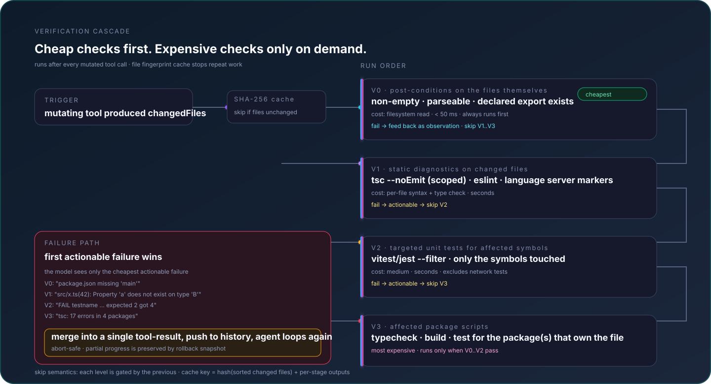

<p align="right">English | <a href="./README.zh-CN.md">简体中文</a></p>

# MoCode

A terminal coding agent: give it a goal, and it **completes it autonomously** — no step-by-step hand-holding required.

MoCode explores your code, reads/writes/edits files, runs shell commands, and searches the web on its own, driving the task forward through a loop of "think → call a tool → observe the result → think again." It works with any OpenAI-compatible endpoint (GLM, DeepSeek, Qwen, local Ollama / vLLM, etc.), runs as a full-screen TUI with streaming output and visible reasoning.

## Architecture

MoCode is organized as a layered runtime: the terminal experience drives an autonomous core, the core reaches capabilities through a guarded execution plane, and a persistent intelligence layer keeps long-running work coherent.

<p align="center"></p>

### Autonomous execution loop

Each model response is one step in a closed loop. Tool calls are classified by declared capabilities, safe reads can run in parallel, writes acquire canonical resource locks, observations are encoded before returning to context, and code changes pass through automatic validation.

<p align="center"></p>

### Context that ages instead of exploding

Tool output does not accumulate as an undifferentiated transcript. Typed encoders, relevance pruning, an observation lifecycle, age-aware compression, and a five-zone budget scheduler continuously reshape the active working set while sessions, snapshots, skills, notes, and memory retain durable knowledge.

<p align="center"></p>

### Multi-agent work without unsafe shared writes

Read-only sub-agents fan out concurrently. Writer agents work inside private filesystem overlays and return structured ChangeSets; the coordinator checks expected hashes, acquires canonical locks, performs conflict-safe merges, and runs one unified verification gate in the main workspace.

<p align="center"></p>

### Controlled execution: permission gates and capability scheduling

Every mutating tool calls into a permission layer before it runs. Tools are classified `safe` / `confirm` / `dangerous`, scopes can be `once` / `session` / `project` / global-tool, fingerprints are stable hashes (command, path, or args), and the persistent record lives in `~/.mocode/permissions.json` (v3 schema, with v2 resource grants still loaded). Piped or CI environments default to deny until you opt in.

<p align="center"></p>

### Verification cascade: cheap checks first, expensive checks only on demand

Code changes go through V0 (file post-conditions) → V1 (scoped tsc/eslint markers) → V2 (targeted unit tests) → V3 (affected package scripts). The first actionable failure stops the cascade and is fed back to the agent as a fresh observation; a SHA-256 content cache skips repeated work on unchanged files.

<p align="center"></p>

### Rollback timeline: per-mutation snapshots, restore by turn

A clean undo point is saved before every mutating tool. `/rollback <turnId>` restores file buffers in reverse-chronological order under canonical resource locks, then reruns V0+V1 to confirm a clean state — never re-runs the model. Read tools, network effects, and binary changes are explicitly out of scope, kept honest in the contract.

<p align="center"></p>

### Context controls: five independent dials, not one big toggle

`autoCompact` / `contextOptimize` / `contextRelprune` / `contextLifecycle` / `contextBudget` each gate a different knob (push-time compression, encoders, superseded-read pruning, observation lifecycle, five-zone scheduler). Each is independently killable via a `MOCODE_*=false` env var; the observation lifecycle runs even with all toggles off, so context still ages instead of exploding. An EWMA self-calibrates the token estimator against real provider usage.

<p align="center"></p>

### Desktop pet: a passive mirror over WebSocket

The optional Electron sub-package (`packages/pet-app`) shows a stateful floating character that mirrors agent activity via a one-way WebSocket stream. Quit with `/pet quit`. The renderer owns no business logic; the agent loop is unchanged regardless of whether the pet is running.

<p align="center"></p>

## Why MoCode

MoCode isn't a chat box with a coat of paint — it's an agent that actually gets things done:

- **Autonomous multi-step execution** — In a single conversation, the agent chains multiple steps on its own: read code, edit code, run tests, fix based on errors, and so on. It decides the next step without you nagging it. When it hits a decision point, it calls `ask_human` to pop up a panel and ask you (blocking until you respond).
- **Parallel read-only tools** — Consecutive read-only operations in a turn (reading files, grep, glob, codegraph, web search/fetch) run concurrently, so total time is roughly the slowest single call instead of the sum of all of them. Operations with side effects (writing/editing files) stay sequential to preserve snapshot ordering and data safety.
- **Sub-agents divide and conquer** — Complex tasks can spawn independent sub-agents with isolated histories and scoped toolsets. Read-only workers can fan out concurrently; writer workers run in private filesystem overlays and return ChangeSets that are merged under expected-hash checks and canonical resource locks. Only structured findings return to the main thread.
- **Plan / Auto dual mode** — In `plan` mode the agent is read-only (reads code, queries indexes, searches — never writes to disk, runs commands, or spawns sub-agents) and produces a plan; `auto` mode unlocks the full toolset. The agent can switch between the two on its own — scope out an unfamiliar codebase first, then start making changes.
- **Automatic context compression** — As the context window fills up, a three-tier compression kicks in (trim individual results → compact older tool results in place → summarize older turns), so long sessions never overflow. `/context` shows live token usage; `/compact` triggers manual compression (optionally with a focus hint to preserve what matters).
- **Cross-session long-term memory** — The agent can save project architecture, conventions, and lessons learned as long-term memory, auto-loaded in future sessions. A background process periodically reflects on conversations to mine things worth remembering. Memories can be created, searched, updated, and forgotten, with recall-based decay.
- **Project context (Snapshot + Skill)** — Two complementary systems help the agent understand your project: **Project Snapshot** automatically scans files and generates LLM-enhanced summaries (project description, tech stack, commands, module responsibilities, directory tree); **Project Skill** is a manually maintained knowledge base capturing design decisions, architectural insights, pitfalls, and conventions. Snapshot provides *what/where* (facts), Skill provides *why/how* (insights) — no duplication, ~46% token savings.
- **Session notepad (notes.md)** — For complex multi-step tasks (≥3 file changes / ≥5 tool calls), the agent maintains a working notepad at `.mocode/sessions/<sessionId>/notes.md` (file-based, survives context compression). It can record intermediate findings, design decisions, open questions, and structured plans. A live progress chip in the TUI status bar shows `plan: [title] (3/7) ▸ [current step]` when a `## Plan:` section is present. The agent manages the file directly with write_file/edit_file/read_file.
- **Interruptible and reversible** — Ctrl+C interrupts the current turn at any time (kills child processes recursively, rolls history back to before the turn started, leaves no half-finished tool calls). `/rollback` restores file changes from per-turn snapshots, with a per-file keep/undo choice — no git dependency required.
- **Sandbox protection** — File reads/writes go through a sandbox that blocks out-of-bounds paths (`../../`, absolute paths outside the root, symlink escapes, etc.), so the agent never touches files outside your working directory.

## Features

- **Streaming output + visible reasoning** — Responses render as they're generated; when the model supports reasoning, the thinking process is visible in real time and auto-collapses to save screen space.
- **Full-screen TUI** — Alt-screen mode with a fixed status bar, scrollback (PgUp/PgDn), typeahead while the agent is running, and auto-prefill for the next turn.
- **Session persistence** — Every turn is saved automatically; `--resume` / `/resume` picks up a past session.
- **Skills system** — Scans directories like `~/.mocode/skills/` automatically; each skill's description is injected into the system prompt, and the model calls `use_skill` to load the full instructions only when relevant (progressive disclosure: skim the summary first, load the body only if needed).
- **Optional desktop pet** — A small floating window (`/pet`) shows a stateful character that mirrors agent activity (idle / thinking / tool running / waiting for human). Works as a separate process over WebSocket; quit it with `/pet quit`. Sits beside the terminal, never blocks it.
- **Slash commands** — `/exit` `/clear` `/context` `/skills` `/compact` `/resume` `/rollback` `/memory` `/reflect` `/init` `/theme` `/model` `/plan` `/auto` `/pet`, with dropdown filtering as you type.

## Documentation

- [中文使用指南](./docs/usage.md) — 菜单式快速上手、命令速查、模式、会话、项目上下文与排障。
- [Project context](./docs/USAGE_SNAPSHOT_SKILL.md) — Snapshot and Project Skill reference.

## Installation

Requires Node.js ≥ 18.

```bash
npm install -g mocode-ai
```

This gives you the `mocode` command. Prefer not to install globally? Run it directly with `npx mocode-ai`.

> MoCode checks for new versions on startup and self-updates in the background via `npm i -g mocode-ai@latest` — the update takes effect on the next launch, with zero startup delay and silent failure if offline. This is skipped in dev mode (`npm start`, running via tsx).

### Run from source (development / contributing)

```bash
git clone https://github.com/wanxunyang/mocode.git
cd mocode
npm install
npm start
```

Source runs directly via tsx, no build step. After changing code, restart `npm start` for changes to take effect (tsx loads modules at startup, no hot reload). Runtime dependencies: `openai`, `dotenv`, `fast-glob`; dev dependencies: `tsx`, `typescript`, `@types/node`.

## Configuration

On first use, run the setup wizard to fill in three fields interactively (API base URL / key / model name), written to `~/.mocode/config` (global, works from any directory or terminal):

```bash
mocode config
```

You can also configure it from inside the REPL with the `/model` command (pick a backend preset interactively and fill in each field, applied immediately and persisted). Without configuration, the REPL still opens and prompts you to run `/model`.

You can also hand-edit the config files. MoCode loads them in the following priority order (later entries override earlier ones, only backfilling unset environment variables; anything `export`ed in your shell always takes precedence):

1. `<cwd>/.env` — legacy compatibility, lowest priority (see `.env.example` in the source repo for reference)
2. `~/.mocode/config` — global (written by `/model` and `mocode config`)
3. `<cwd>/.mocode/config` — project-level override, highest priority

Three required fields:

```env
LLM_BASE_URL=https://open.bigmodel.cn/api/v3   # swap in your backend
LLM_API_KEY=your-key-here
LLM_MODEL=glm-4.6                              # swap in your model name
```

Common backend `base_url` values:

| Backend        | base\_url                                           |
| -------------- | ---------------------------------------------------- |
| GLM (Zhipu)    | `https://open.bigmodel.cn/api/v3`                   |
| DeepSeek       | `https://api.deepseek.com`                          |
| Qwen (Alibaba) | `https://dashscope.aliyuncs.com/compatible-mode/v1` |
| Local Ollama   | `http://localhost:11434/v1`                         |
| Local vLLM     | `http://localhost:8000/v1`                          |

> The model must support OpenAI-style function calling, otherwise tools won't be triggered.

### Optional configuration

| Environment variable       | Description                                                          | Default                     |
| --------------------------- | ---------------------------------------------------------------------- | --------------------------- |
| `MAX_TOKENS`                | Max tokens per response                                               | unlimited                   |
| `CONTEXT_WINDOW_TOKENS`     | Model context window; must match the real model                      | `128000`                    |
| `COMPACT_THRESHOLD`         | Auto-compaction trigger threshold (fraction of window)                | `0.85`                      |
| `LLM_STREAM_USAGE`          | Include `stream_options.include_usage` on streaming requests for real usage | `true`                |
| `AUTO_COMPACT`               | Auto-compaction master switch                                          | `true`                       |
| `MOCODE_AUTO_VALIDATE`       | Auto-run the lowest-cost discovered validation command after code changes; feed failures back to the agent | `true` |
| `AUTO_REFLECT`               | Background reflection pass master switch (periodically mines memories from conversations) | `true`   |
| `REFLECT_EVERY_N`            | Trigger a background reflection every N turns (runs alongside the agent, non-blocking) | `5`      |
| `ANYSEARCH_API_KEY`         | Web search API key (falls back to anonymous free quota if unset)      | none                         |
| `ANYSEARCH_BASE_URL`        | Search API endpoint                                                    | `https://api.anysearch.com` |
| `SKILLS_DIRS`               | Override the default skill scan directories (platform path separator) | three default directories   |
| `MOCODE_CONTEXT_OPTIMIZE`   | Typed encoding of tool results before they reach the LLM (tree/search/log…); disable for raw passthrough (length trimming only) | `true` |
| `MAX_STEPS`                 | Max agent loop steps per turn (infinite-loop safety only)             | `1000`                       |
| `SUB_AGENT_MAX_STEPS`       | Sub-agent loop safety ceiling; defaults to the main-agent value       | `1000`                       |
| `SANDBOX_ROOT`               | Sandbox root directory (file operation boundary; falls back to cwd if unset) | none                  |
| `MOCODE_THEME`               | Color theme (default/dark/light…; shell env takes precedence over file) | `default`                   |

## Usage

```bash
mocode                          # new session (run inside your target project directory)
mocode --resume                 # list saved sessions
mocode --resume <id>            # resume a specific session
mocode config                   # edit configuration
```

Running from source uses `npm start` (equivalent to `mocode`, but skips the self-update check).

Once in the REPL, just start chatting. It launches straight into the full-screen TUI, showing a banner (model / backend / working directory / tool list). Responses stream in, with the reasoning section visible in real time before collapsing.

The agent operates in **the working directory it was launched from** — to have it work on a specific project, `cd` into that project before running `mocode`.

## Tools

| Tool             | Purpose                                                                  |
| ---------------- | ------------------------------------------------------------------------- |
| `read_file`       | Read a file with line numbers; supports `offset` / `limit`               |
| `write_file`      | Create/overwrite a file, auto-creating parent directories                |
| `edit_file`       | Precise string replacement (`old_string` must match uniquely)            |
| `run_command`     | Run a shell command, merging stdout+stderr, 120s default timeout         |
| `glob`            | Find files by glob pattern (excludes node\_modules/.git)                 |
| `grep`            | Regex content search, pure JS implementation, no `rg` dependency         |
| `codegraph`       | With a `.codegraph/` index built, query symbol source and call chains (more accurate and cheaper than read\_file/grep) |
| `web_search`      | Web search (AnySearch), returns title/URL/snippet/body                   |
| `web_fetch`       | Fetch a URL, cleaning HTML into plain text                                |
| `use_skill`       | Load the full SKILL.md instructions for a given skill                    |
| `ask_human`        | Pop up a Q&A panel at decision points; user picks a preset or types freely (blocks until answered) |
| `switch_mode`      | Switch between `plan` (read-only planning) and `auto` (full execution); the agent can call this itself to explore before acting |
| `drop_context`     | Replace irrelevant old tool results in history with stubs to free up context (preserves tool_call_id pairing, leaves system prompt and current turn untouched, idempotent) |
| `sub-agent`        | Spawn a capable isolated worker; read tasks can run concurrently and writes use overlay + ChangeSet safe merge |

| `memory_save`      | Save a piece of cross-session long-term memory (title indexed, body fetched on demand) |
| `memory_search`    | Search memory bodies by keyword; hits boost the recall count (affects forgetting decay) |
| `memory_list`       | List the memory index (id/title/summary, no body)                        |
| `memory_update`     | Edit a memory in place (id unchanged; correct stale facts / update summary / toggle pin) |
| `memory_forget`     | Forget a memory: archived by default (recoverable), `mode=delete` for a hard delete (pinned memories can't be deleted) |

The five `memory_*` tools are gated on `MEMORY_ENABLED=true` at startup; toggle at runtime with `/memory_switch` (REPL restart required, by design — see Skills section for the difference between Tier-1 `MOCODE.md` and Tier-2 memory).

## Slash commands

| Command           | Purpose                                                              |
| ------------------ | ----------------------------------------------------------------------- |
| `/exit` `/quit`     | Exit MoCode                                                          |
| `/clear`            | Clear history (keeps the system prompt) + clear screen               |
| `/context`          | Show a context usage bar (tokens / message count, estimated or measured) |
| `/skills`           | List discovered skills                                               |
| `/compact`          | Compress history (optionally with a focus hint: `/compact …`)        |
| `/resume`           | Resume a saved session                                                |
| `/rollback`         | Menu to pick a turn to roll back to (↑↓ · Enter)                     |
| `/memory`           | Show memory library: entry count + recent index                       |
| `/memory_switch`   | Toggle Tier-2 memory on/off (REPL restart required — by design)       |
| `/reflect`          | Manually trigger a background memory reflection pass                  |
| `/model`            | Configure the LLM (baseURL / apiKey / model / context window), applied immediately + persisted |
| `/init`             | Scan the project and generate `MOCODE.md` project memory (dispatched to the agent) |
| `/theme`            | Switch color theme (↑↓ · Enter, or `/theme <name>` directly)         |
| `/plan`             | Switch to plan mode (read-only exploration + plan output, approve to switch to auto) |
| `/auto`             | Switch back to auto mode (full toolset execution)                     |
| `/pet`              | Toggle the optional desktop pet (floating window mirroring agent state) |
| `/pet skin`         | Pick a pet skin (↑↓ · Enter)                                          |
| `/pet quit`         | Fully shut down the pet process (not just disconnect)                 |
| `/snapshot_refresh` | Refresh project snapshot (re-scan files + regenerate LLM summary)     |
| `/snapshot`         | Toggle project snapshot on/off                                        |

Type `/` to trigger the dropdown menu, keep typing to filter; Esc to cancel.

## Quick verification (after configuring your key)

```
> hello, who are you                  # verify LLM connectivity
> read sample.txt                     # triggers read_file
> change foo to bar in sample.txt     # triggers read_file + edit_file
> list all .txt files in this directory  # triggers glob
> search the code for runAgent        # triggers grep
> run node -e "console.log(1+1)"      # triggers run_command
> search what's new in TypeScript 5.5 # triggers web_search
```

Each step prints `● tool name + argument summary` and `↳ result preview` in the terminal; the agent decides the next step on its own within the loop, with responses streaming in as they're generated.

## Skills

MoCode automatically scans the following directories for skills (each skill is a `<name>/SKILL.md` with frontmatter):

- `~/.claude/skills/`
- `~/.mocode/skills/`
- `<cwd>/.mocode/skills/`

A skill's `description` is injected into the system prompt (progressive disclosure, tier 1); the model calls `use_skill` to load the full body (tier 2) only when the task is relevant. Use `/skills` to see discovered skills.

## Project Context (Snapshot + Skill)

MoCode uses two complementary systems to help the agent understand your project:

- **Project Snapshot** (automatic + LLM-enhanced, enabled by default): Scans your project files and generates a structured summary including project description, tech stack, key commands, module responsibilities, and directory tree. Stored in `.mocode/snapshot.json` and reused across sessions. Use `/snapshot` to toggle it and `/snapshot_refresh` after major changes.
- **Project Skill** (manual + AI-assisted, disabled by default): A knowledge base for design decisions, architectural patterns, pitfalls, conventions, and workflow notes. Enable it with `/project_skill on` (or `MOCODE_PROJECT_SKILL=true`), generate an initial draft with `/project_skill init`, then refine `.mocode/project-skill.md`. The agent can update it through `project_skill_update` during conversations.

**Complementary principle**: Snapshot provides *what/where* (facts: files, structure, commands), Skill provides *why/how* (insights: decisions, behaviors, gotchas). No duplication, ~46% token savings compared to the previous approach.

Control via environment variables:
- `MOCODE_PROJECT_SNAPSHOT=false` — disable snapshot
- `MOCODE_PROJECT_SKILL=true` — enable Project Skill

See [docs/USAGE_SNAPSHOT_SKILL.md](./docs/USAGE_SNAPSHOT_SKILL.md) for detailed usage.

## Project memory (MOCODE.md)

MoCode has a **two-tier memory** model distinct from skills:

- **Tier-1 — `MOCODE.md` (auto-loaded every session):** Markdown project memory that gets concatenated into the system prompt on every turn. Discovery walks `~/.mocode/MOCODE.md` → every `MOCODE.md` from the cwd up to the filesystem root (far→near, near wins). On overflow the body is truncated with a marker pointing back at the files. Generate or refresh one with `/init`, or write it by hand — it's plain Markdown, no schema. `MOCODE.md` is also where the agent itself persists "next-session facts" it deduces (architecture, conventions, pitfalls).
- **Tier-2 — `memory_*` tool library (agent-driven, opt-in):** Discrete tagged records (`decision` / `fact` / `pitfall` / `reference` / `feedback`) with recall-count-based decay (30-day → archived; 90-day → GC). The agent saves / searches / updates / forgets via tools; titles go in the system-prompt index (≤50), bodies fetched on demand via `memory_search`. Off by default; toggle with `MEMORY_ENABLED=true` at startup or `/memory_switch` (REPL restart required).

## Type checking

```bash
npm run typecheck   # tsc --noEmit
```

## Future extensions

MCP tool integration, finer-grained capability locks, and a real worktree-isolated sub-agent mode. The current version is a streaming, reasoning-visible, rollback-capable terminal coding agent with 20 tools, working-notepad planning, cross-session memory, capability-aware tool scheduling, serial workspace-sharing sub-agents, and an optional desktop pet.
