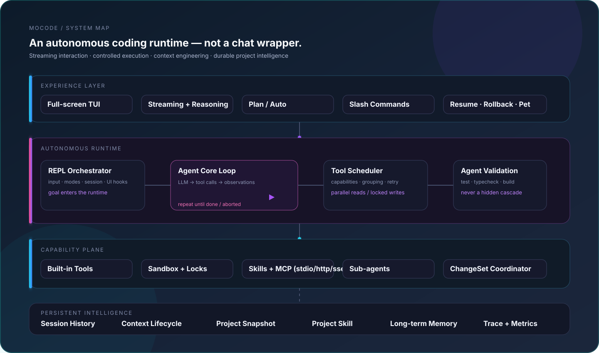
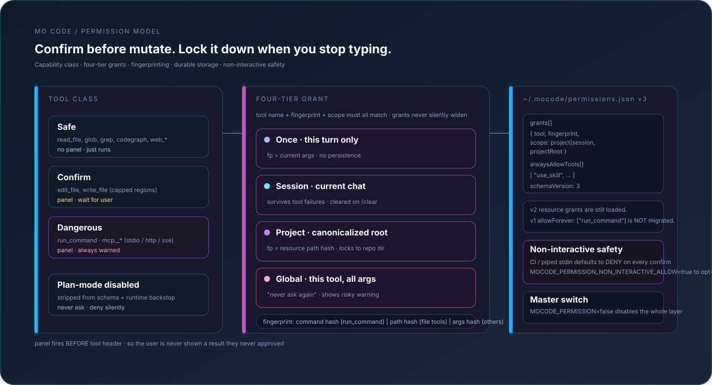
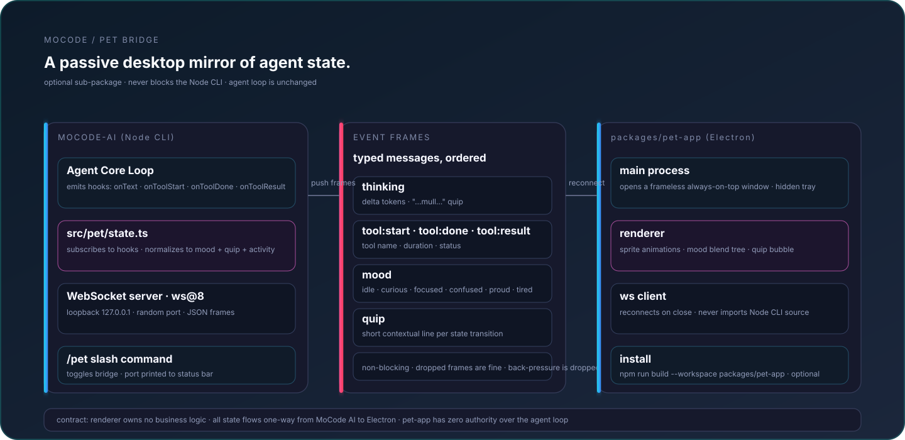

<p align="right">English | <a href="./README.zh-CN.md">简体中文</a></p>

# MoCode

[](https://www.npmjs.com/package/mocode-ai)
[](https://www.npmjs.com/package/mocode-ai)
[](https://github.com/wanxunyang/mocode/actions/workflows/ci.yml)
[](https://github.com/wanxunyang/mocode/blob/main/LICENSE)

A terminal coding agent: give it a goal, and it **completes it autonomously** — no step-by-step hand-holding required.

MoCode explores your code, reads/writes/edits files, runs shell commands, and searches the web on its own, driving the task forward through a loop of "think → call a tool → observe the result → think again." It works with any OpenAI-compatible endpoint (GLM, DeepSeek, Qwen, local Ollama / vLLM, etc.), runs as a full-screen TUI with streaming output and visible reasoning.

## Demo

See mocode complete real tasks autonomously:

**Fixing documentation drift in its own codebase** — mocode counts the actual built-in tools, finds the mismatch with `package.json` and `AGENTS.md`, and rewrites them so all three sources agree.

<p align="center"></p>

**Building a web app from scratch, with visual self-verification** — mocode creates a complete Pomodoro timer (HTML/CSS/JS, no third-party libs, Web Audio API), then uses `dev_server` + `browser` + `screenshot` to inspect its own render and iterate until the layout looks right.

<p align="center"></p>

## Faster and more token-efficient

- **Two-level model picker** — A bare `/model` lists providers first; Enter drills into one to pick a model. Search is scoped to the current level — provider names at the top, model names inside a provider — never mixed into one flat list.
- **Reasoning effort `/effort`** — One normalized `off / low / medium / high / auto`, translated per target model (Anthropic / OpenAI o·gpt-5 / Qwen3 / GLM / DeepSeek-R1 / Doubao). Unknown models and third-party gateways get **no** unknown fields, avoiding hard 400s.
- **Usage stats `/stats`** — This session's cache hit rate, tiered token usage, and compaction count, built from real provider reports rather than estimates.
- **Cache-safe compaction fork** — When prior dialogue can be reused verbatim, it forks to preserve the prompt-cache prefix and avoid rebilling; otherwise it falls back to summarization (disable with `MOCODE_COMPACT_FORK=false`).
- **Repeated-read de-duplication** — Re-reading the same file within one turn hits a cache, so you never pay twice for identical content (disable with `MOCODE_READ_DEDUP=false`).
- **Sub-agent depth gate** — Recursive spawning is capped at 3 levels by default (tune with `SUB_AGENT_MAX_DEPTH`), preventing unbounded sub-agent fan-out.

## Engineering discipline

MoCode keeps code-level control light and leaves task strategy to the agent:

- **Advisory working discipline** — The system prompt asks the agent to make focused changes, avoid redundant retrieval, and decide for itself whether validation is useful. Validation is optional and is never a completion gate.
- **Bounded tool retries, explicit failures** — The runtime automatically retries only transient errors from tools explicitly marked `idempotent`, at most twice. `TIMEOUT`, permission denial, cancellation, and non-idempotent calls are not automatically retried. The resulting structured outcome is returned to the agent for any further recovery decision; see [Automatic retry](#automatic-retry-the-retryable-contract).
- **`ask_human` for user-owned decisions** — The agent asks only when repository evidence cannot resolve a high-impact choice; implementation details remain autonomous.
- **Five-zone context controls + token self-calibration** — Five independent dials (`autoCompact` / `contextOptimize` / `contextRelprune` / `contextLifecycle` / `contextBudget`) manage context pressure. Token estimation self-calibrates against provider usage.

## Architecture

MoCode is organized as a layered runtime: the terminal experience drives an autonomous core, the core reaches capabilities through a guarded execution plane, and a persistent intelligence layer keeps long-running work coherent.

Implementation entry points: [Agent core](src/agent/core.ts), [tool dispatch](src/agent/stages/tool-dispatcher.ts), and [tool execution](src/tools/tool-runtime.ts).

<p align="center"></p>

### Autonomous execution loop

Each model response is one step in a closed loop. Tool calls are classified by declared capabilities, safe reads can run in parallel, and writes acquire canonical resource locks. Tool evidence returns to history unchanged apart from a hard per-result safety cap. When the agent has no more tools to call, its response completes immediately; the framework does not run hidden validation or force another model turn.

### Context compression only under real pressure

Normal sessions retain full tool evidence and structured freshness/provenance metadata. At 80% of the model window, one scheduler event runs enabled exact-supersession, stale-artifact, and old-log/search cleanup, then always compacts history. Lifecycle tracking never ages content by tool-call count.

The implementation is defined by [budget accounting](src/context/budget.ts) and [pressure scheduling](src/session/scheduler.ts).

### Multi-agent work in a shared workspace

Sub-agents keep independent history branches, can reuse the parent's conversation prefix, and cannot expand beyond the tool set delegated by the parent step. Consecutive sub-agent calls run in bounded parallel batches (`SUB_AGENT_CONCURRENCY`, default `5`; set `1` for sequential dispatch).

**History isolation is not filesystem isolation.** Sub-agents write directly to the shared workspace and inherit the parent's current rollback turn. There is no private filesystem overlay, per-worker worktree, or post-task ChangeSet merge. Nested tools acquire their own resource locks; supported file edits enforce their own expected-hash checks. These guards do not make an entire multi-step sub-task an isolated transaction. The parent receives the final summary, status, usage, and tracked changed files rather than the full worker transcript. Validation remains an explicit agent choice.

See [sub-agent execution](src/agent/spawn.ts), [the sub-agent tool](src/tools/builtins/task.ts), and [capability-based dispatch](src/agent/stages/tool-dispatcher.ts).

### Controlled execution: permission gates and capability scheduling

Every mutating tool calls into a permission layer before it runs. Tools are classified `safe` / `confirm` / `dangerous`, scopes can be `once` / `session` / `project` / global-tool, fingerprints are stable hashes (command, path, or args), and the persistent record lives in `~/.mocode/permissions.json` (v3 schema, with v2 resource grants still loaded). In piped or CI environments, unapproved `confirm` / `dangerous` actions are denied by default; safe operations do not require an interactive prompt.

<p align="center"></p>

### Agent-directed validation

MoCode does not run a hidden validation cascade when a task ends. The agent can explicitly call `run_command` for a focused test, typecheck, or build when it judges that evidence useful; otherwise it may finish without an extra framework-controlled round trip.

### Rollback timeline: tracked file changes, restore by turn

Rollback records supported text-file mutations, including tracked changes made by sub-agents in the parent's turn. `/rollback` restores recorded file contents under canonical resource locks; it does not re-run the model or launch automatic tests. It is not a universal undo mechanism: network effects, desktop actions, binary changes, and other untracked effects are outside its scope. Cancelling a turn does not automatically undo completed file writes.

See the [rollback store](src/rollback/store.ts) for capture and restore boundaries.

### Context controls: one pressure gate, independently optional stages

The controls remain independently configurable, but automatic rewriting has exactly one trigger: corrected or raw request occupancy reaching 80%. That event runs every enabled pressure cleanup and then always compacts history. `contextLifecycle` only tracks provenance metadata, while EWMA calibration keeps the estimate aligned with provider usage.

### Desktop pet: a passive mirror over WebSocket

The optional Electron sub-package (`packages/pet-app`) shows a stateful floating character that mirrors agent activity via a one-way WebSocket stream. Quit with `/pet quit`. The renderer owns no business logic; the agent loop is unchanged regardless of whether the pet is running.

<p align="center"></p>

## Why MoCode

MoCode isn't a chat box with a coat of paint — it's an agent that actually gets things done:

- **Autonomous multi-step execution** — In a single conversation, the agent chains multiple steps on its own: read code, edit code, run tests, fix based on errors, and so on. It decides the next step without you nagging it. When it hits a decision point, it calls `ask_human` to pop up a panel and ask you (blocking until you respond).
- **Capability-aware concurrency** — Consecutive tools declared safe to parallelize (such as file reads, grep, glob, and web reads) can run concurrently. Resource-locked file mutations can also be dispatched together: canonical locks coordinate conflicting resources rather than serializing every write globally. Process tools and tools without parallel capabilities retain their declared serial behavior.
- **Sub-agents divide and conquer** — Workers have independent history branches and inherit the parent step's tool ceiling. They run in bounded parallel batches, write directly to the shared workspace, and share the parent's rollback turn. A final summary and execution metadata return to the parent; there is no per-worker filesystem isolation or merge stage.
- **Plan / Auto dual mode** — In `plan` mode the agent explores and produces a plan without editing project files, running shell commands, or spawning sub-agents; internal session/plan records may still be persisted. `auto` mode permits execution. Tool capabilities are not a static “full” mode: a lightweight LLM router selects the minimum sufficient groups for each real user turn, and the main model may add groups on a later step when needed.
- **Pressure-driven context compression** — Normal history keeps full tool evidence. At 80% occupancy, one scheduler event runs all enabled cleanup and always follows with a history summary. `/context` shows live usage and `/compact` remains an explicit manual override.
- **Cross-session long-term memory** — The agent can save project architecture, conventions, and lessons learned as long-term memory, auto-loaded in future sessions. Optional background reflection mines conversations for useful memories when `AUTO_REFLECT=true` (off by default). Memories can be created, searched, updated, and forgotten, with recall-based decay.
- **Project context (`AGENTS.md`)** — A single project-level memory file at `AGENTS.md` captures both static facts (project description, commands, module list, directory tree) and human/AI-written insights (conventions, architectural decisions, pitfalls). Generate it once with `/init`, then keep it up to date by hand or by asking the agent to refresh it. Auto-injected into the system prompt every turn, but lean by design: the `directory tree` and `extension points` sections stay out of the prompt as one-line pointers (read_file `AGENTS.md` on demand), keeping the always-on payload small. During work, the agent may append stable, non-obvious facts it discovers to `.mocode/agents-draft.md`; `/init` merges and clears that draft.
- **Session notepad (notes.md)** — For complex multi-step tasks (≥3 file changes / ≥5 tool calls), the agent maintains a working notepad at `.mocode/sessions/<sessionId>/notes.md` (file-based, survives context compression). It records the execution plan with the dedicated `plan_update` tool — a three-state step machine (`pending`/`in_progress`/`completed`, at most one `in_progress`) that auto-settles to `## Done:` when finished. The active plan is re-injected into the system prompt after compaction and re-synced into context whenever notes.md changes, and a gentle reminder nudges the agent if it goes several tool-steps without updating the plan. A live progress chip in the TUI status bar shows `plan: [title] (3/7) ▸ [current step]`.
- **Interruptible and reversible** — Ctrl+C propagates cancellation to model requests and supported running tools. History returns to the latest committed tool-batch checkpoint rather than unconditionally discarding the entire turn. Completed file writes remain until explicitly reverted; `/rollback` restores tracked file changes from turn snapshots with a per-file keep/undo choice, without requiring git.
- **Input safety net** — Long prompts no longer fear a stray Enter: `Ctrl+G` opens an in-TUI composer popup (notepad-style editing — Enter inserts a newline, with soft wrap, selection, copy/cut/paste and undo; Ctrl+S fills the text back into the input box without sending). `Ctrl+R`/`Ctrl+P` fuzzy-search your input history (Enter only fills it back), and the post-send recall window widens to 2 seconds with any-key recall for long inputs.
- **File-path boundaries** — Built-in file reads/writes reject paths outside `SANDBOX_ROOT` (the working directory by default), including traversal and symlink escapes. This is a file-tool path guard, not an OS-level sandbox for shell commands, MCP servers, or desktop input. Memory and skills may intentionally use configured locations outside the project. Review permissions before allowing high-risk tools; see [sandbox policy](src/sandbox/policy.ts).
- **Computer Use (high-risk, routed only for explicit GUI intent)** — When the request genuinely requires real mouse/keyboard interaction, the router can expose the `computer-control` group and feed each resulting screenshot back to the model. `/cu off` (or `MOCODE_COMPUTER_USE_ENABLED=false`) is a hard veto; `/cu on` merely allows routing and does not keep the tool permanently visible. The blast radius exceeds file tools because OS input bypasses the file sandbox. **Use a VM / sandbox / dedicated test machine**, not a daily driver. Every action still passes the permission gate, and plan mode always blocks it. Windows first; macOS/Linux pending.

## Features

- **Streaming output + visible reasoning** — Responses render as they're generated; when the model supports reasoning, the thinking process is visible in real time and auto-collapses to save screen space.
- **Full-screen TUI** — Alt-screen mode with a fixed status bar, scrollback (PgUp/PgDn), typeahead while the agent is running, and auto-prefill for the next turn.
- **Session persistence** — Every turn is saved automatically; `--resume` / `/resume` picks up a past session.
- **Background jobs** — `mocode run --bg "task"` spawns a detached process that survives terminal close; state and logs land in `.mocode/jobs/`, and `/jobs` lists, tails logs, or kills them. Set `MOCODE_NOTIFY_WEBHOOK` to push a finish notification (ntfy/Bark/Telegram/generic). When an unattended job hits an unauthorised confirm/dangerous action it parks (status `paused`) and pings you; approve in another terminal with `mocode approve <id>` (`mocode deny` to reject, or `/jobs approve` inside the TUI), and it resumes in the same process. Follow a running (or finished) job live with `mocode attach <id>`. Long jobs checkpoint their history after every tool batch; if the process dies or the machine reboots, `mocode resume-job <id>` replays from the last checkpoint (in-flight work is re-run). `MOCODE_JOB_MAX_MS` / `MOCODE_JOB_MAX_TOKENS` add hard wall-clock/token caps.
- **Named bots** — `mocode bots add` defines role-based bots (job-specific system prompt + optional exact-tool whitelist + sandbox scope) at project/global level; run with `--bot <name>`, combine with `run --bg` or schedules.
- **Arena** — The `arena` tool runs the same task N times (2-6) as parallel independent workers, then a judge model ranks every candidate against your criteria and returns the winner with the full ranking. Useful for design/exploration/problem-solving where several attempts beat one.
- **Persistent bot messaging** — The `message_bus` tool gives named bots a durable, asynchronous message store (`send` / `inbox` / `ack` / `history`): a supervisor bot can hand off work to another bot that is not currently running; the worker reads its inbox later (e.g. when a schedule wakes it), does the job, and replies. Identity follows the `--bot` identity, and each bot only sees/acks its own messages.
- **Scheduled tasks** — `mocode schedule add` registers cron and/or webhook triggers; a local detached daemon (`schedule start`, loopback-only) fires background jobs on time or on `POST /trigger/<token>`, with per-minute dedup. A stateless `schedule tick` is also available for OS task schedulers.
- **Headless one-shot mode** — `mocode -p "task"` or piped `echo "task" | mocode`, with optional `--json` structured output; confirm/dangerous actions are denied by default when non-interactive (opt in with `--dangerously-skip-permissions`; `--verbose` adds tool-result summaries, `--session-dir <dir>`, `--worktree` ephemeral git worktree), and sessions are still saved for `--resume`.
- **Skills system** — Scans directories like `~/.mocode/skills/` automatically; each skill's description is injected into the system prompt, and the model calls `use_skill` to load the full instructions only when relevant (progressive disclosure: skim the summary first, load the body only if needed).
- **Optional desktop pet** — A small floating window (`/pet`) shows a stateful character that mirrors agent activity (idle / thinking / tool running / waiting for human). Works as a separate process over WebSocket; quit it with `/pet quit`. Sits beside the terminal, never blocks it.
- **Slash commands** — `/exit` `/clear` `/cd` `/context` `/skills` `/compact` `/resume` `/rollback` `/jobs` `/schedules` `/bots` `/memory` `/reflect` `/init` `/theme` `/model` `/effort` `/stats` `/plan` `/auto` `/pet`, with dropdown filtering as you type.

## Documentation

- [中文使用指南](./docs/usage.md) — 菜单式快速上手、命令速查、模式、会话、项目上下文与排障。
- [Project context](./docs/usage.md#项目上下文) — `AGENTS.md` and Skills.

## Installation

Requires Node.js ≥ 18.

```bash
npm install -g mocode-ai
```

This gives you the `mocode` command. Prefer not to install globally? Run it directly with `npx mocode-ai`.

> MoCode does not contact the registry on startup. Use `/upgrade check`, `/upgrade status`, or `/upgrade now` explicitly when you want to check or install an update. Real installation is disabled in source/tsx development mode; see the [upgrade implementation](src/commands/upgrade.ts).

### Run from source (development / contributing)

```bash
git clone https://github.com/wanxunyang/mocode.git
cd mocode
npm install
npm start
```

Source runs directly via tsx, no build step. After changing code, restart `npm start` for changes to take effect (tsx loads modules at startup, no hot reload). Install from the repository root so npm resolves the workspaces. Dependency lists and development commands are maintained in [package.json](package.json), rather than duplicated here.

### Repository stacks and contributing

The production path is the TypeScript CLI. `packages/work-app` is incubating, `packages/pet-app` is optional, and `rust/` is an experimental, non-critical-path TUI with a mandatory promotion/archive deadline. See:

- [stack status and owners](docs/architecture/stack-status.md)
- [architecture decisions](docs/adr/README.md)
- [contribution guide](CONTRIBUTING.md)
- [maintainer and troubleshooting runbooks](docs/runbooks/README.md)
- [Rust experiment status](rust/README.md)

Do not import another package's `src/` or internal `dist/` layout. Applications consume package exports and the public `mocode-agent-host` bin contract.

### Keeping documentation aligned

When changing execution, permissions, concurrency, rollback, or upgrade behavior, update both `README.md` and `README.zh-CN.md` against the implementation links in these sections. Diagrams must describe the same current behavior before being embedded. Use the package manifests and built-in registry for dependency/tool inventories, and the stack-status page for release boundaries; do not treat a design proposal or an old diagram as a shipped guarantee.

## Configuration

On first use, run the setup wizard to fill in three fields interactively (API base URL / key / model name), written to `~/.mocode/config` (global, works from any directory or terminal):

```bash
mocode config
```

You can also configure it from inside the REPL with the `/model` command (pick a backend preset interactively and fill in each field, applied immediately and persisted). Without configuration, the REPL still opens and prompts you to run `/model`.

You can also hand-edit the config files. MoCode loads them in the following priority order (later entries override earlier ones, only backfilling unset environment variables; anything `export`ed in your shell always takes precedence):

1. `<cwd>/.env` — legacy compatibility, lowest priority (see `.env.example` in the source repo for reference)
2. `~/.mocode/config` — global (written by `/model` and `mocode config`)
3. `<cwd>/.mocode/config` — project-level override, highest priority

Three required fields:

```env
LLM_BASE_URL=https://open.bigmodel.cn/api/v3   # swap in your backend
LLM_API_KEY=your-key-here
LLM_MODEL=glm-4.6                              # swap in your model name
```

Common backend `base_url` values:

| Backend        | base_url                                            |
| -------------- | --------------------------------------------------- |
| GLM (Zhipu)    | `https://open.bigmodel.cn/api/v3`                   |
| DeepSeek       | `https://api.deepseek.com`                          |
| Qwen (Alibaba) | `https://dashscope.aliyuncs.com/compatible-mode/v1` |
| Local Ollama   | `http://localhost:11434/v1`                         |
| Local vLLM     | `http://localhost:8000/v1`                          |

> The model must support OpenAI-style function calling, otherwise tools won't be triggered.

### Optional configuration

| Environment variable            | Description                                                                                   | Default                     |
| ------------------------------- | --------------------------------------------------------------------------------------------- | --------------------------- |
| `MAX_TOKENS`                    | Max tokens per response                                                                       | unlimited                   |
| `CONTEXT_WINDOW_TOKENS`         | Model context window; must match the real model                                               | `256000`                    |
| `LLM_STREAM_USAGE`              | Include `stream_options.include_usage` on streaming requests for real usage                   | `true`                      |
| `AUTO_COMPACT`                  | Final history-compaction safety fallback                                                      | `true`                      |
| `AUTO_REFLECT`                  | Background reflection pass (opt-in; periodically mines memories from conversations)           | `false`                     |
| `REFLECT_EVERY_N`               | Trigger a background reflection every N turns (runs alongside the agent, non-blocking)        | `5`                         |
| `ANYSEARCH_API_KEY`             | Web search API key (falls back to anonymous free quota if unset)                              | none                        |
| `ANYSEARCH_BASE_URL`            | Search API endpoint                                                                           | `https://api.anysearch.com` |
| `SKILLS_DIRS`                   | Override the default skill scan directories (platform path separator)                         | three default directories   |
| `MOCODE_CONTEXT_OPTIMIZE`       | Typed encoding of Cold logs/searches, only under real pressure (set `false` to disable)       | `true`                      |
| `MOCODE_CONTEXT_RELPRUNE`       | Exact superseded-evidence pruning, only under real pressure (set `false` to disable)          | `true`                      |
| `MOCODE_LIFECYCLE`              | Provenance metadata tracking; never ages or rewrites content                                  | `true`                      |
| `MAX_STEPS`                     | Max agent loop steps per turn (infinite-loop safety only)                                     | `1000`                      |
| `SUB_AGENT_MAX_STEPS`           | Sub-agent loop safety ceiling; defaults to the main-agent value                               | `1000`                      |
| `SUB_AGENT_CONCURRENCY`         | Concurrent sub-agent calls per dispatch batch; `1` dispatches them sequentially               | `5`                         |
| `SUB_AGENT_MAX_DEPTH`           | Maximum recursive delegation depth                                                            | `3`                         |
| `SANDBOX_ROOT`                  | Sandbox root directory (file operation boundary; falls back to cwd if unset)                  | none                        |
| `MOCODE_SUBAGENT_ENABLED`       | Set `false` to veto the `orchestration` route group; unset/`true` allows on-demand routing    | unset                       |
| `MOCODE_FRONTEND_TOOLS_ENABLED` | Set `false` to veto `browser-debug` and `desktop-observe` (does not affect `background-exec`); unset/`true` allows routing | unset                       |
| `MOCODE_COMPUTER_USE_ENABLED`   | Set `false` to veto high-risk `computer-control`; unset/`true` allows explicit-intent routing | unset                       |
| `MEMORY_ENABLED`                | Set `false` to veto memory groups; `true` also enables the Memory Index                       | unset                       |
| `MOCODE_SHELL`                  | Default shell for `run_command` / `dev_server`: `cmd` \| `powershell` \| `bash`                | `cmd` (Windows) / `bash`    |
| `MOCODE_WEB_FETCH_PROXY`        | Prefix-style plaintext proxy used by `web_fetch` only when a direct fetch is blocked (e.g. `https://r.jina.ai/`); opt-in because it hands your URLs to a third party | unset (disabled) |
| `MOCODE_THEME`                  | Color theme (default/dark/light…; shell env takes precedence over file)                       | `default`                   |

## Usage

```bash
mocode                          # new session (run inside your target project directory)
mocode --resume                 # list saved sessions
mocode --resume <id>            # resume a specific session
mocode config                   # edit configuration
```

Running from source uses `npm start`. Neither source nor installed runs automatically check for updates at startup; `/upgrade` is an explicit user action, and real installation is disabled in source/tsx mode.

Once in the REPL, just start chatting. It launches straight into the full-screen TUI, showing a banner (model / backend / working directory / tool list). Responses stream in, with the reasoning section visible in real time before collapsing.

The agent operates in **the working directory it was launched from** — to have it work on a specific project, `cd` into that project before running `mocode`.

## Tools

Every real user turn first goes through a constrained LLM router. Common tools include `read_file`, `glob`, `grep`, `web_search`, `web_fetch`, `plan_update`, `note_append`, `ask_human`, and `use_skill`; additional capabilities are selected as composable groups for writing, shell debugging, browser debugging, desktop observation/control, memory, orchestration, and MCP. If the initial set is insufficient, the main model requests more groups with `add_tool_groups`; the expanded schemas appear on the next model step. A routing failure reuses the previous turn's groups (or common-only), never the full toolset.

The tables below are selected capabilities, not an exhaustive tool inventory. Current registrations and capability declarations are maintained in the [built-in registry](src/tools/builtins/index.ts); exposure is controlled by [ToolPolicy](src/tools/policy.ts). Codegraph queries use an installed skill/CLI when available, not a standalone built-in `codegraph` tool.

| Tool          | Purpose                                                                                                                                                               |
| ------------- | --------------------------------------------------------------------------------------------------------------------------------------------------------------------- |
| `read_file`   | Read a file: text with line numbers (`offset` / `limit`), images (PNG/JPEG/GIF/WebP detected by magic bytes) as visual model input; other binaries are rejected instead of dumped as garbled text |
| `write_file`  | Create/overwrite a file, auto-creating parent directories; `append=true` adds to the end without re-sending the whole file                                              |
| `edit_file`   | Precise string replacement (`old_string` must match uniquely)                                                                                                         |
| `run_command` | Run a foreground shell command, merging stdout+stderr, 120s default timeout; `shell=cmd\|powershell\|bash` picks the interpreter                                       |
| `glob`        | Find files by glob pattern (excludes node_modules/.git)                                                                                                               |
| `grep`        | Regex content search powered by ripgrep (bundled via `@vscode/ripgrep`; respects `.gitignore`, skips binaries), falling back to a pure-JS scan only when no `rg` binary is available; `context=N` returns neighbouring lines inline so a hit rarely needs a follow-up read                  |
| `web_search`  | Web search (AnySearch), returns title/URL/snippet/body                                                                                                                |
| `web_fetch`   | Fetch a URL, cleaning HTML into plain text; browser-like headers, auto-retry on transient failures, optional plaintext-proxy fallback                                 |
| `use_skill`   | Load the full SKILL.md instructions for a given skill                                                                                                                 |
| `ask_human`   | Pop up a Q&A panel at decision points; user picks a preset or types freely (blocks until answered)                                                                    |
| `plan_update` | Record/update the session execution plan (the `## Plan:` block in notes.md); three-state steps, at most one in_progress, auto-settles to `## Done:` when all complete |
| `sub-agent`   | Spawn a worker with an independent history and the parent step's tool ceiling; bounded concurrency, shared workspace and rollback turn                                                        |

| Memory tool | Purpose |
| ----------- | ------- |
| `memory_save` | Save a piece of cross-session long-term memory (title indexed, body fetched on demand) |
| `memory_search` | Search memory bodies by keyword; hits boost the recall count (affects forgetting decay) |
| `memory_list` | List the memory index (id/title/summary, no body) |
| `memory_update` | Edit a memory in place (id unchanged; correct stale facts / update summary / toggle pin) |
| `memory_forget` | Forget a memory: archived by default (recoverable), `mode=delete` for a hard delete (pinned memories can't be deleted) |
| `memory_graph` | Traverse neighbors, find paths, add triples, or inspect graph statistics; keyword search is provided by `memory_search` |

The six `memory_*` tools are split into `memory-read` and `memory-write` route groups. They appear only when the router selects them; `MEMORY_ENABLED=false` vetoes both groups, while `MEMORY_ENABLED=true` also enables the compact Memory Index in the prompt. `/memory_switch` manages that compatibility gate.

Frontend capabilities are also split by purpose: `browser` forms `browser-debug`, whole-desktop `screenshot` is `desktop-observe`, and `dev_server` has its own `background-exec` group (not controlled by `/fe`; execution still goes through permissions) — any process that must outlive a single tool call (dev server, inference service, watcher, log tail) belongs there rather than in `run_command`. Selecting `browser-debug` implies `background-exec`, so a weak model that only asks for the browser still gets the ability to start the server it needs to look at. Image reading lives in `read_file` (magic-byte sniffing) and remains a common read tool. The router may combine these groups with `computer-control` when a task genuinely needs both structured web diagnostics and real desktop interaction. `/fe off` is a hard veto, not a manual profile selector — it does not affect `dev_server`.

### Shell selection

`run_command` and `dev_server` accept `shell=cmd|powershell|bash`. The default is unchanged from earlier releases (`cmd.exe` on Windows, `bash` elsewhere) so existing prompts and skills keep working; `MOCODE_SHELL` flips the default globally for those who prefer POSIX on Windows. When `bash` is requested on Windows, Git for Windows' `bash.exe` is auto-detected — the WSL `System32\bash.exe` is deliberately excluded, since it lands in a Linux distro with different paths, toolchain, and security policy. Non-interactive `cmd.exe` cannot run `timeout /t`; use `shell=powershell` with `Start-Sleep`, or `shell=bash` with `sleep`.

### Automatic retry (the `retryable` contract)

`ToolOutcome.retryable` used to have zero consumers project-wide — a tool honestly marked "this was a transient failure" and nothing acted on it, leaving the model to burn a full LLM round-trip to retry (and often forgetting to). The runtime now re-issues calls that fail transiently, with backoff (400ms / 1200ms, two retries max):

- Only tools that explicitly declare `idempotent` participate — the side-effect-free network reads (`web_fetch`, `web_search`). No write or process tool declares it, and none is ever auto-retried: retrying those would duplicate side effects, so their retry semantics stay inside the tool (e.g. `edit_file`'s `expected_hash` conflict).
- Only `status=error` with `retryable=true` is retried; `denied` / `aborted` / `success` are terminal.
- **`TIMEOUT` is never auto-retried**: one timeout has already consumed the whole window (`web_fetch` uses 30s), so two retries could stretch a single tool call to 90s — exactly the frozen-spinner experience users hate. The `retryable` flag is still reported, so the model can decide for itself.
- Aborting mid-backoff gives up immediately instead of burning the window, and when retries are exhausted the attempt count is appended to the output so the model knows the runtime already tried.

### Frontend / UI loop

`dev_server` + `browser` form a loop of "start it → open the page → see the rendered result":

```
dev_server start  command="npm run dev"  readyUrl="http://localhost:5173"
browser    open  →  navigate  →  click / fill  →  screenshot
dev_server stop   id=srv-xxxx
```

- `dev_server` processes survive across tool calls (`run_command` can't — it tree-kills children on timeout or when the turn is interrupted). Readiness waiting supports `readyUrl` (loopback only) or `readyPattern` (matches startup logs); logs go to `.mocode/dev-servers/<id>.log` and support incremental reads via `offset`.
- `browser` page sessions also persist across calls; screenshots feed back to the model through the multimodal channel, along with recent console output, page errors, and failed requests.
- Safe defaults: `browser` only allows `http/https` on `localhost / 127.0.0.1 / ::1`, rejecting `file:` and credentialed URLs; set `MOCODE_BROWSER_ALLOW_REMOTE=true` to reach remote hosts. `dev_server` runs arbitrary commands and shares `run_command`'s `dangerous` risk class — requires user confirmation before execution.
- Both are disabled in plan mode; on exit mocode tree-kills background processes and closes the browser.
- The browser binary is not bundled with the npm package; run `npx playwright install chromium` before first use.

## Slash commands

| Command          | Purpose                                                                                        |
| ---------------- | ---------------------------------------------------------------------------------------------- |
| `/exit` `/quit`  | Exit MoCode                                                                                    |
| `/clear`         | Clear history (keeps the system prompt) + clear screen                                         |
| `/cd`            | Switch workspace (`/cd <path>`; bare `/cd` shows current, `/cd -` returns). Old session is saved to the old workspace, the new one starts like `/clear` |
| `/image`         | Attach a local image to the next message; supports `attach <path>` / `list` / `clear`          |
| `/context`       | Show a context usage bar (tokens / message count, estimated or measured)                       |
| `/skills`        | List discovered skills                                                                         |
| `/compact`       | Compress history (optionally with a focus hint: `/compact …`)                                  |
| `/resume`        | Resume a saved session                                                                         |
| `/rollback`      | Menu to pick a turn to roll back to (↑↓ · Enter)                                               |
| `/memory`        | Show memory library: entry count + recent index                                                |
| `/memory_switch` | Allow/block memory routing and toggle the Memory Index; effective next real user turn          |
| `/reflect`       | Manually trigger a background memory reflection pass                                           |
| `/model`         | Two-level picker (provider → model; scoped search), plus baseURL / apiKey / context-window config; applied immediately + persisted |
| `/effort`        | Set reasoning effort off/low/medium/high/auto (e.g. `/effort high`); not sent for unrecognized models |
| `/stats`         | Session usage: cache hit rate / tiered tokens / compaction count |
| `/upgrade`       | Explicit update check/status/install (`check` / `status` / `now`); no automatic startup update |
| `/init`          | Scan the project and generate `AGENTS.md` project memory (dispatched to the agent)             |
| `/theme`         | Switch color theme (↑↓ · Enter, or `/theme <name>` directly)                                   |
| `/plan`          | Switch to plan mode (read-only exploration + plan output, approve to switch to auto)           |
| `/auto`          | Switch back to executable mode; tools are routed per task                                      |
| `/pet`           | Toggle the optional desktop pet (floating window mirroring agent state)                        |
| `/fe`            | Allow/block automatic routing of `browser-debug` and `desktop-observe`                         |
| `/cu`            | Allow/block automatic routing of high-risk `computer-control`                                  |
| `/subagent`      | Allow/block automatic routing of `orchestration`                                               |
| `/pet skin`      | Pick a pet skin (↑↓ · Enter)                                                                   |
| `/pet quit`      | Fully shut down the pet process (not just disconnect)                                          |

Type `/` to trigger the dropdown menu, keep typing to filter; Esc to cancel.

## Quick verification (after configuring your key)

```
> hello, who are you                  # verify LLM connectivity
> read sample.txt                     # triggers read_file
> change foo to bar in sample.txt     # triggers read_file + edit_file
> list all .txt files in this directory  # triggers glob
> search the code for runAgent        # triggers grep
> run node -e "console.log(1+1)"      # triggers run_command
> search what's new in TypeScript 5.5 # triggers web_search
```

Each step prints `● tool name + argument summary` and `↳ result preview` in the terminal; the agent decides the next step on its own within the loop, with responses streaming in as they're generated.

## Skills

MoCode automatically scans the following directories for skills (each skill is a `<name>/SKILL.md` with frontmatter):

- `~/.claude/skills/`
- `~/.mocode/skills/`
- `<cwd>/.mocode/skills/`

A skill's `description` is injected into the system prompt (progressive disclosure, tier 1); the model calls `use_skill` to load the full body (tier 2) only when the task is relevant. Use `/skills` to see discovered skills.

## Working discipline

The system prompt provides lightweight guidance rather than a framework gate: inspect only what matters, make focused changes, avoid repeated stale reads, and report uncertainty honestly. The agent decides whether validation is useful for the task and chooses the scope itself. Broad test/build suites are not run by default, and lack of validation never blocks completion or triggers an extra model turn.

## Project memory (AGENTS.md)

MoCode has a **two-tier memory** model distinct from skills:

- **Tier-1 — `AGENTS.md` (auto-loaded every session):** Markdown project memory that gets concatenated into the system prompt on every turn. Discovery walks `~/.mocode/AGENTS.md` → every `AGENTS.md` from the cwd up to the filesystem root (far→near, near wins). On overflow the body is truncated with a marker pointing back at the files. Generate or refresh one with `/init`, or write it by hand — it's plain Markdown, no schema. `AGENTS.md` is also where the agent itself persists "next-session facts" it deduces (architecture, conventions, pitfalls).
- **Tier-2 — `memory_*` tool library (agent-driven, routed on demand):** Discrete tagged records (`decision` / `fact` / `pitfall` / `reference` / `feedback`) with recall-count-based decay (30-day → archived; 90-day → GC). The LLM router selects `memory-read` for retrieval and `memory-write` only for explicit persistence intent. Set `MEMORY_ENABLED=false` to veto both groups; `true` additionally injects the compact Memory Index. The agent searches before saving and updates existing entries rather than duplicating them.

## Type checking

```bash
npm run typecheck   # protocol/runtime + root + tests + evals
```

## Future extensions

MCP tool integration is already supported; see the [MCP configuration guide](src/mcp/README.md). Finer-grained capability coordination and optional per-worker worktree isolation are extension directions, not guarantees of the current shared-workspace sub-agent implementation. Current tool registrations are maintained in the [built-in registry](src/tools/builtins/index.ts), and production, optional, incubating, and experimental stacks are distinguished in [stack status](docs/architecture/stack-status.md).
