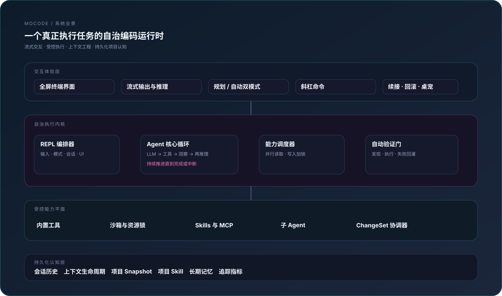
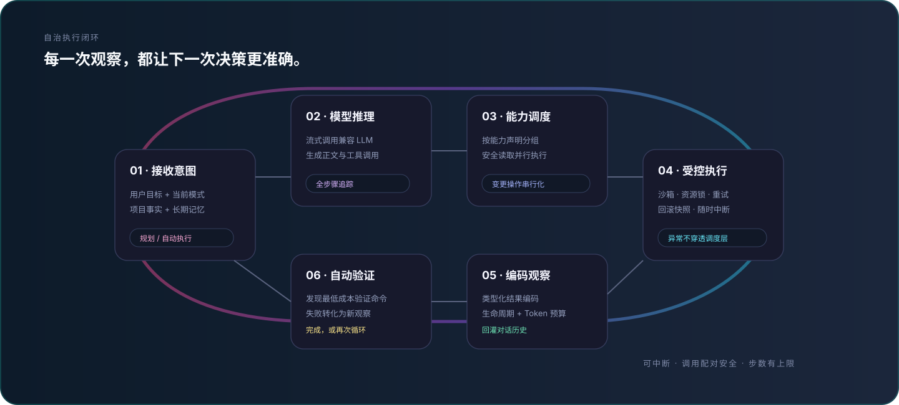
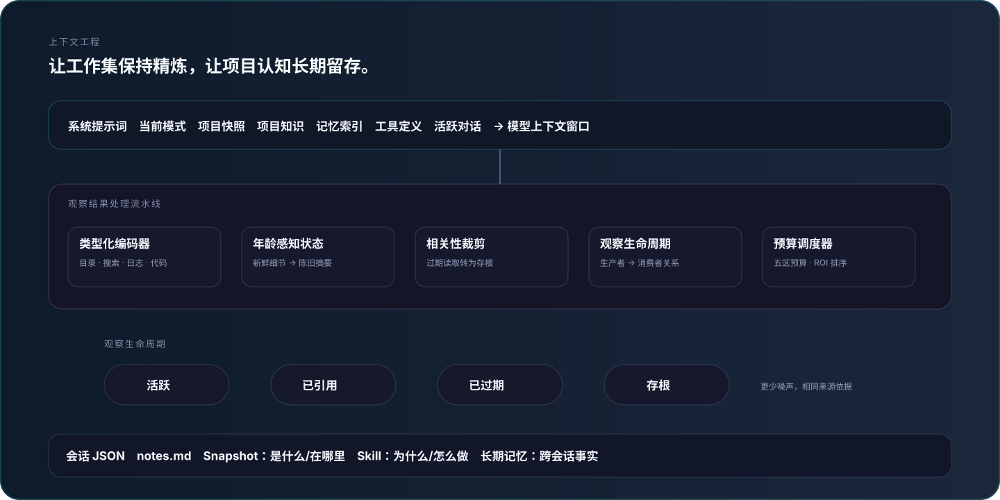
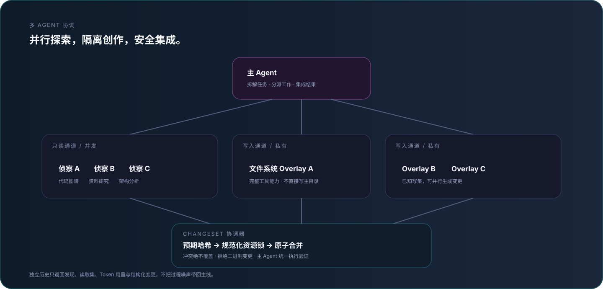

<p align="right"><a href="./README.md">English</a> | 简体中文</p>

# MoCode

一个终端编码 agent:你给一个目标,它**自主完成**——不需要你逐步指挥。

mocode 自己探索代码、读写改文件、执行命令、联网查资料,以「思考 → 调用工具 → 观察结果 → 再思考」的循环一步步把任务推进到完成。接任意 OpenAI 兼容接口(GLM、DeepSeek、Qwen、本地 Ollama / vLLM 等),全屏 TUI 交互,流式输出、思考过程可见。

## 架构

MoCode 是一个分层的自治运行时：终端交互层驱动 Agent 内核，内核通过受控能力平面执行真实操作，持久化认知层则让长任务和跨会话工作保持连贯。

<p align="center"></p>

### 自治执行循环

每次模型响应都是闭环中的一步。工具调用按能力声明分类，安全读取可以并行，写操作获取规范化资源锁，观察结果编码后才回到上下文，代码改动最终经过自动验证门。

<p align="center"></p>

### 会衰减、不会膨胀的上下文

工具输出不会作为无差别日志无限堆积。类型化编码、相关性裁剪、观察生命周期、年龄感知压缩和五区预算调度持续重塑活跃工作集；会话、Snapshot、Skill、notes.md 与长期记忆负责保留耐久知识。

<p align="center"></p>

### 多 Agent 并行，但不冒险共享写入

只读子 Agent 可以并行扇出；写任务在私有文件系统 overlay 中完成并返回结构化 ChangeSet。协调器校验 expected hash、获取规范化资源锁、安全合并冲突，最后由主工作区统一执行验证。

<p align="center"></p>

## 为什么用 mocode

mocode 不是一个套壳聊天框,而是一个能真正动手干活的 agent:

- **自主多步推进** — 一次对话里连续多步:读代码、改代码、跑测试、根据报错再改……agent 自己决定下一步,中途不用你反复催。遇到卡点会调 `ask_human` 弹面板问你(阻塞到回应)。
- **只读工具并行执行** — 一轮里连续的只读操作(读文件、grep、glob、codegraph、联网搜索/抓取)自动并发跑,总耗时 ≈ 最慢一个,而不是逐个排队。写文件 / 改文件这类有副作用的操作仍串行,保快照顺序与数据安全。
- **子 agent 分而治之** — 复杂任务可派生拥有独立历史与受限工具集的子 agent。只读 worker 可并行扇出；写 worker 在私有文件系统 overlay 中运行，返回的 ChangeSet 经过 expected hash 校验与规范化资源锁后才合并。主线只接收结构化发现，不接收过程噪声。
- **计划 / 执行双模式** — `plan` 模式下只读探查(读代码、查索引、搜索,绝不写盘、不跑命令、不派生子 agent),产出计划;`auto` 模式全量工具放开。agent 还能在两者间自切换——先把陌生代码库摸清,再动手改。
- **上下文自动压缩** — 接近窗口上限时三层压缩(单条结果裁剪 → 旧工具结果原地微压缩 → 旧对话摘要),长会话也不爆窗口;`/context` 实时显示 token 用量,`/compact` 可手动压缩(能带焦点指令聚焦保留)。
- **跨会话长期记忆** — agent 能把项目架构、约定、踩过的坑存成长期记忆,下次会话自动加载;后台还会定期从对话里反思挖掘值得记住的事。记忆可增删改、带召回衰减。
- **会话记事本(notes.md)** — 复杂多步任务(≥3 处文件改动 / ≥5 步工具调用)时,agent 在 `.mocode/sessions/<sessionId>/notes.md` 维护一个工作记事本(落盘抗压缩),可记录中间发现、设计决策、待验证问题和结构化计划。TUI 状态栏实时显示进度 chip:`plan: [标题] (3/7) ▸ [当前步]`(当存在 `## Plan:` 段时)。agent 直接用 write_file/edit_file/read_file 管理此文件。
- **可中断、可回滚** — Ctrl+C 随时打断当前轮次(树杀子进程,历史还原到本轮开始前,不留残半的工具调用);`/rollback` 按轮次快照恢复文件改动,逐个文件「保留/撤销」,不依赖 git。
- **沙箱防护** — 文件读写经沙箱拦截,挡掉越界路径(`../../`、绝对外圈、软链出圈等),不碰工作目录之外的文件。

## 特性

- **流式输出 + 思考可见** — 回复边生成边显示;模型支持 reasoning 时思考过程实时可见,思考段自动折叠(不占屏)
- **全屏 TUI** — 备用屏(alt screen)+ 固定底栏状态行 + 滚动回看(PgUp/PgDn),运行中可打字(typeahead),下一轮自动预填
- **会话持久化** — 每轮自动落盘,`--resume` / `/resume` 续接历史会话
- **Skills 系统** — 自动扫描 `~/.mocode/skills/` 等目录,description 注入系统提示,模型按需调 `use_skill` 加载完整指令(渐进式披露:先看简介,任务相关才加载正文)
- **可选桌宠** — 独立悬浮窗(`/pet`)显示一个小角色,镜像 agent 活动(空闲 / 思考 / 跑工具 / 等人工),独立进程走 WebSocket,`/pet quit` 完全关闭。挂在终端外,绝不挡终端。
- **斜杠命令** — `/exit` `/clear` `/context` `/skills` `/compact` `/resume` `/rollback` `/memory` `/reflect` `/init` `/theme` `/model` `/plan` `/auto` `/pet`,输入时下拉过滤

## 使用文档

- [菜单式使用指南](./docs/usage.md) — 快速上手、命令速查、模式、会话、项目上下文与排障。
- [项目上下文：Snapshot 与 Project Skill](./docs/USAGE_SNAPSHOT_SKILL.md)

## 安装

要求 Node.js ≥ 18。

```bash
npm install -g mocode-ai
```

装完即得 `mocode` 命令。不想全局装也可免装直跑:`npx mocode-ai`。

> mocode 启动时自动检测新版本,后台 `npm i -g mocode-ai@latest` 自更新——下次启动生效,零启动延迟、断网 / 失败静默。开发态 `npm start`(tsx 跑 `.ts`)不触发。

### 从源码运行(开发 / 贡献)

```bash
git clone https://github.com/wanxunyang/mocode.git
cd mocode
npm install
npm start
```

源码经 tsx 直接跑,无构建步骤。改完代码需重启 `npm start` 生效(tsx 启动时加载模块,不热更新)。依赖:`openai`、`dotenv`、`fast-glob`(运行时);`tsx`、`typescript`、`@types/node`(开发)。

## 配置

首次使用运行配置向导,交互填三项(API 地址 / key / 模型名),写入 `~/.mocode/config`(全局,任意目录、任意终端生效):

```bash
mocode config
```

也可直接 `mocode` 进入 REPL 后用 `/model` 命令配置(交互选后端预设 + 逐项填写,即时生效 + 持久化)。未配置时 REPL 仍能打开,会提示你跑 `/model`。

也可手写配置文件。mocode 按以下优先级加载(后者覆盖前者,仅回填未设置的环境变量;shell 里 `export` 的永远最优先):

1. `<cwd>/.env` — 旧用法兼容,优先级最低(源码仓库内有 `.env.example` 可参考)
2. `~/.mocode/config` — 全局(`/model` 与 `mocode config` 写此文件)
3. `<cwd>/.mocode/config` — 项目级覆盖,优先级最高

必填三项:

```env
LLM_BASE_URL=https://open.bigmodel.cn/api/v3   # 换成你的后端
LLM_API_KEY=your-key-here
LLM_MODEL=glm-4.6                              # 换成你的模型名
```

常见后端 `base_url`:

| 后端        | base\_url                                           |
| --------- | --------------------------------------------------- |
| GLM(智谱)   | `https://open.bigmodel.cn/api/v3`                   |
| DeepSeek  | `https://api.deepseek.com`                          |
| Qwen(阿里)  | `https://dashscope.aliyuncs.com/compatible-mode/v1` |
| 本地 Ollama | `http://localhost:11434/v1`                         |
| 本地 vLLM   | `http://localhost:8000/v1`                          |

> 模型必须支持 OpenAI 风格的 function calling,否则工具不会触发。

### 可选配置

| 环境变量                    | 说明                                         | 默认值                         |
| ----------------------- | ------------------------------------------ | --------------------------- |
| `MAX_TOKENS`            | 单次回复最大 token                               | 不限                          |
| `CONTEXT_WINDOW_TOKENS` | 模型上下文窗口,须对齐真实模型                            | `128000`                    |
| `COMPACT_THRESHOLD`     | 自动压缩触发阈值(占窗口比例)                            | `0.85`                      |
| `LLM_STREAM_USAGE`      | 流式请求带 `stream_options.include_usage` 拿真实用量 | `true`                      |
| `AUTO_COMPACT`          | 自动压缩总开关                                    | `true`                      |
| `AUTO_REFLECT`          | 后台反思 pass 总开关(定期从会话挖掘记忆)                   | `true`                      |
| `REFLECT_EVERY_N`       | 每 N 轮触发一次后台反思(与 agent 并发,不阻塞)              | `5`                         |
| `ANYSEARCH_API_KEY`     | 联网搜索 API key(不配走匿名免费额度)                    | 无                           |
| `ANYSEARCH_BASE_URL`    | 搜索 API 端点                                  | `https://api.anysearch.com` |
| `SKILLS_DIRS`           | 覆盖默认 skill 扫描目录(平台分隔符)                     | 三目录自动扫描                     |
| `MOCODE_CONTEXT_OPTIMIZE` | 工具结果进 LLM 前的类型化编码(树/搜索/日志…),关掉则原样进(仅长度裁剪) | `true`                      |
| `MAX_STEPS`             | 每轮 Agent 循环最大步数（仅防无限循环）                 | `1000`                      |
| `SUB_AGENT_MAX_STEPS`   | 子 Agent 循环安全上限，默认与主 Agent 一致             | `1000`                      |
| `SANDBOX_ROOT`          | 沙箱根目录(文件操作边界;未配则用 cwd 兜底)                | 无                           |
| `MOCODE_THEME`          | 颜色主题(default/dark/light…;shell 设置优先于文件)      | `default`                   |

## 运行

```bash
mocode                          # 新会话(在目标项目目录里跑)
mocode --resume                 # 列出已保存会话
mocode --resume <id>            # 续接指定会话
mocode config                   # 改配置
```

从源码跑则用 `npm start`(等价于 `mocode`,但不触发自更新)。

进入 REPL 后直接对话。启动即进全屏 TUI,显示横幅(模型 / 后端 / 工作目录 / 工具列表)。回复流式打印,思考段实时可见后折叠。

agent 工作在**启动时所在的工作目录**——想让它操作某个项目,就 `cd` 到那个项目再 `mocode`。

## 工具

| 工具              | 作用                                                       |
| --------------- | -------------------------------------------------------- |
| `read_file`     | 读文件,带行号,支持 `offset` / `limit`                            |
| `write_file`    | 创建/覆盖文件,自动建父目录                                           |
| `edit_file`     | 精确字符串替换(`old_string` 须唯一匹配)                              |
| `run_command`   | 执行 shell 命令,合并 stdout+stderr,默认 120s 超时                  |
| `glob`          | 按 glob 模式找文件(排除 node\_modules/.git)                      |
| `grep`          | 内容正则搜索,纯 JS 实现,不依赖 `rg`                                  |
| `codegraph`     | 已建 `.codegraph/` 索引时,查代码符号源码与调用链(比 read\_file/grep 更准更省) |
| `web_search`    | 联网搜索(AnySearch),返回标题/URL/摘要/正文                           |
| `web_fetch`     | 抓取指定 URL,HTML 清洗成纯文本                                     |
| `use_skill`     | 加载某 skill 的完整 SKILL.md 指令                                |
| `ask_human`     | 决策点弹终端问答面板,用户选预设项或自由输入(阻塞至回应)                            |
| `switch_mode`   | 在 `plan`(只读规划)与 `auto`(全量执行)间切换;agent 可自行调用,先探查再动手       |
| `drop_context`  | 把历史里无关的旧工具结果替换为存根释放上下文(保 tool_call_id 配对,不动 system 与当前轮;幂等) |
| `sub-agent`     | 派生具备完整能力的隔离子 Agent；只读任务可并发，写任务通过 overlay + ChangeSet 安全合并 |

| `memory_save`   | 存一条跨会话长期记忆(标题进索引,正文按需取)                                  |
| `memory_search` | 按关键词搜记忆正文,命中即提升召回计数(影响遗忘衰减)                              |
| `memory_list`   | 列记忆索引(id/标题/摘要,无正文)                                      |
| `memory_update` | 原地改一条记忆(id 不变;纠正过时事实 / 改摘要 / 改 pin)                      |
| `memory_forget` | 遗忘记忆:默认归档(可复活),`mode=delete` 硬删(pinned 拒删)               |

5 个 `memory_*` 工具受启动时 `MEMORY_ENABLED=true` 总开关控制;运行时切换用 `/memory_switch`(需重启 REPL,刻意为之,见下「项目记忆」小节区分 Tier-1 / Tier-2)。

## 斜杠命令

| 命令              | 作用                                                 |
| --------------- | -------------------------------------------------- |
| `/exit` `/quit` | 退出 mocode                                          |
| `/clear`        | 清空历史(保留系统提示)+ 清屏                                   |
| `/context`      | 显示上下文用量条(token / 消息数 / 估算或实测)                      |
| `/skills`       | 列出已发现的 skill                                       |
| `/compact`      | 压缩历史(可带焦点 `/compact …`)                            |
| `/resume`       | 续接已保存的会话                                           |
| `/rollback`     | 菜单选轮次回滚(↑↓ · Enter)                                |
| `/memory`       | 看记忆库:条目数 + 近期索引                                    |
| `/memory_switch` | 切换 Tier-2 记忆开关(需重启 REPL,刻意为之)                  |
| `/reflect`      | 手动触发一次后台记忆反思 pass                                   |
| `/model`        | 配置大模型(baseURL / apiKey / model / 上下文窗口),即时生效 + 持久化 |
| `/init`         | 扫描项目生成 `MOCODE.md` 项目记忆(发给 agent 执行)               |
| `/theme`        | 切换颜色主题(↑↓ · Enter,或 `/theme <name>` 直切)            |
| `/plan`         | 切到 plan 模式(只读探查 + 产出计划,审批后切 auto 执行)              |
| `/auto`         | 切回 auto 模式(全量工具执行)                                  |
| `/pet`          | 开关桌宠(独立悬浮窗,镜像 agent 状态动画)                          |
| `/pet skin`     | 选桌宠皮肤(↑↓ · Enter)                                  |
| `/pet quit`     | 完全关闭桌宠进程(而非仅断开本连接)                                 |

输入 `/` 触发下拉菜单,继续打字过滤;Esc 取消。

## 快速验证(配好 key 后)

```
> 你好,你是谁                       # 验证 LLM 连通
> 读一下 sample.txt                 # 触发 read_file
> 把 sample.txt 里的 foo 改成 bar    # 触发 read_file + edit_file
> 列出当前目录所有 .txt 文件         # 触发 glob
> 搜一下代码里出现 runAgent 的地方   # 触发 grep
> 跑一下 node -e "console.log(1+1)"  # 触发 run_command
> 搜一下 TypeScript 5.5 有什么新特性  # 触发 web_search
```

每步终端会打印 `● 工具名 + 参数摘要` 与 `↳ 结果预览`,agent 在循环里自己决定下一步;回复流式打印,边生成边显示。

## Skills

mocode 自动扫描以下目录的 skill(每个 skill 是 `<name>/SKILL.md`,带 frontmatter):

- `~/.claude/skills/`
- `~/.mocode/skills/`
- `<cwd>/.mocode/skills/`

skill 的 `description` 注入系统提示(渐进式披露第①层),模型只在任务相关时调 `use_skill` 加载完整正文(第②层)。用 `/skills` 查看已发现的 skill。

## 项目记忆(MOCODE.md)

mocode 的**双层记忆**模型,跟 Skills 是两件事:

- **Tier-1 — `MOCODE.md`(每轮自动加载):** Markdown 项目记忆,每轮拼进 system prompt。发现路径:`~/.mocode/MOCODE.md` → 从 cwd 往上逐级 `MOCODE.md`(远→近拼接,近的覆盖更突出);超长截断并标注原始文件。运行 `/init` 生成或刷新,纯 Markdown,可手写,无 schema。agent 自己推得的「下次要记住的事实」(架构/约定/坑位)也写在这里。
- **Tier-2 — `memory_*` 工具库(agent 主导,需启用):** 离散带标签条目(`decision` / `fact` / `pitfall` / `reference` / `feedback`),按召回计数衰减(30 天 → archived,90 天 → 硬删 GC)。agent 用工具存 / 搜 / 改 / 删;索引(标题)进系统提示(≤50 条),正文按需 `memory_search` 取。默认关,启动 `MEMORY_ENABLED=true` 或 REPL 内 `/memory_switch`(需重启 REPL,刻意为之)。

## 类型检查

```bash
npm run typecheck   # tsc --noEmit
```

## 可后续扩展

MCP 工具集成、更细粒度的 capability 资源锁、真·worktree 隔离的子 agent 模式。当前版本已是流式、思考可见、可回滚的终端编码 agent:20 个工具、工作记事本规划、跨会话记忆、能力感知工具调度、共享工作区串行子 agent、可选桌宠。
