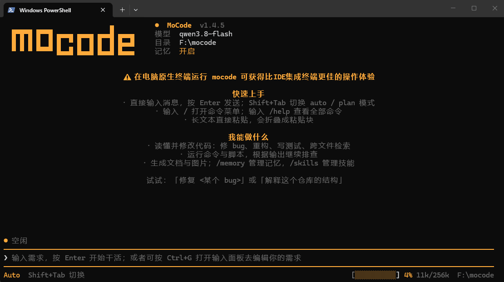
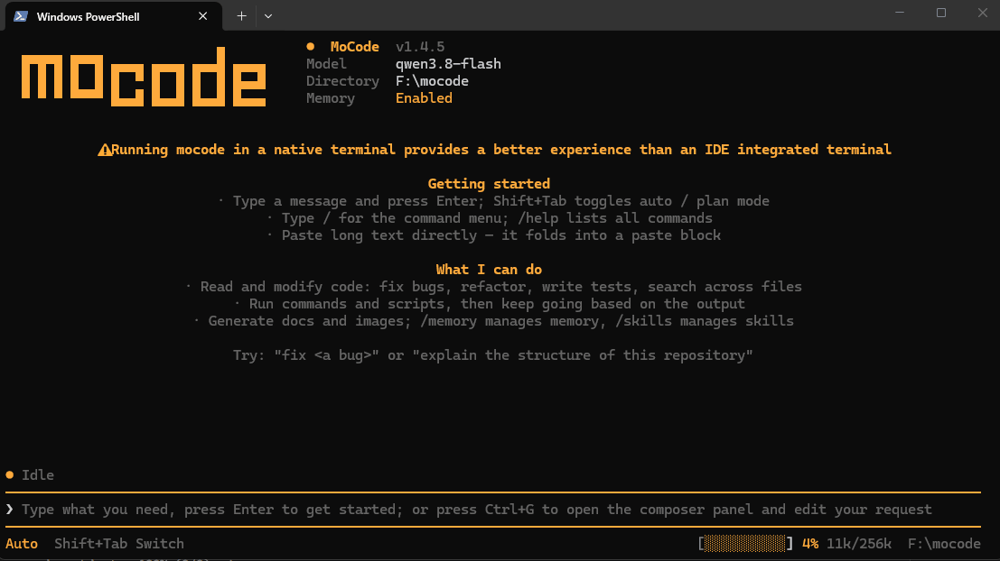
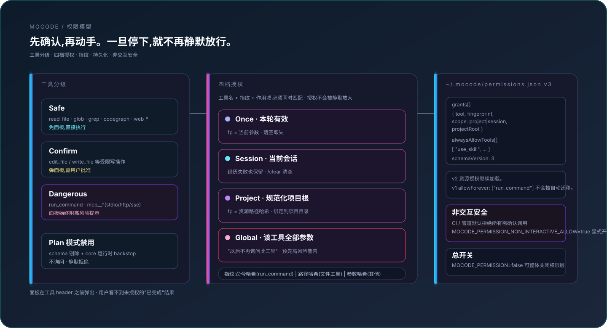
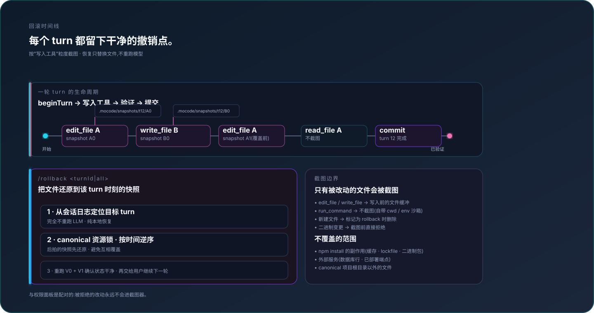
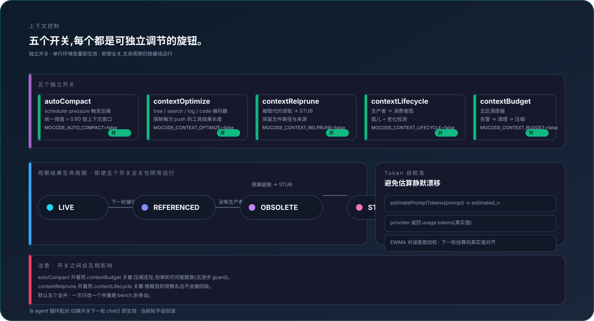
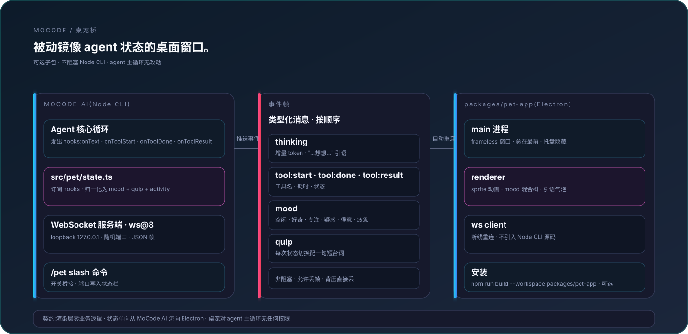

<p align="right"><a href="./README.md">English</a> | 简体中文</p>

# MoCode

[](https://www.npmjs.com/package/mocode-ai)
[](https://www.npmjs.com/package/mocode-ai)
[](https://github.com/wanxunyang/mocode/actions/workflows/ci.yml)
[](https://github.com/wanxunyang/mocode/blob/main/LICENSE)

一个终端编码 agent:你给一个目标,它**自主完成**——不需要你逐步指挥。

mocode 自己探索代码、读写改文件、执行命令、联网查资料,以「思考 → 调用工具 → 观察结果 → 再思考」的循环一步步把任务推进到完成。接任意 OpenAI 兼容接口(GLM、DeepSeek、Qwen、本地 Ollama / vLLM 等),全屏 TUI 交互,流式输出、思考过程可见。

## 演示

看 mocode 自主完成真实任务：

**修自己仓库的文档漂移** —— mocode 逐个数清 `src/tools/builtins/index.ts` 里的实际工具数，发现 `package.json` 和 `AGENTS.md` 的描述不一致，自动改齐并跑测试验证。

<p align="center"></p>

**从零做一个网页应用，自己截图反复改到满意** —— mocode 用原生 HTML/CSS/JS（不引第三方库）+ Web Audio API 完成一个番茄钟，再调用 `dev_server` + `browser` + `screenshot` 检查渲染效果，发现布局问题就改代码再截图，直到满意。

<p align="center"></p>

## 效率:更快、更省 token

- **两级模型面板** — 裸 `/model` 先列厂商、Enter 进入后再选模型;搜索是作用域内过滤——顶层只匹配**厂商名**,厂商内只匹配**模型名**,不再把厂商和模型混在一个结果里。
- **思考强度 `/effort`** — `off / low / medium / high / auto` 五档归一,按目标模型自动翻译成各家方言(Anthropic / OpenAI o·gpt-5 / Qwen3 / GLM / DeepSeek-R1 / 豆包);不认识的模型或第三方网关**不下发**未知字段,避免 400。
- **用量统计 `/stats`** — 本会话缓存命中率、分层 token 用量与压缩次数,基于后端真实上报,不靠估算。
- **缓存安全的压缩分叉** — 能整段复用旧对话时优先走 fork,保住 prompt-cache 前缀、减少重复计费;不满足条件再回落摘要(`MOCODE_COMPACT_FORK=false` 关闭)。
- **重复读取去重** — 同一轮对同一文件的重复读取命中缓存,不再为相同内容重复付费(`MOCODE_READ_DEDUP=false` 关闭)。
- **子 Agent 深度闸** — 递归派生默认最多 3 层(`SUB_AGENT_MAX_DEPTH` 可调),防止子 agent 无限膨胀。

## 架构

MoCode 是一个分层的自治运行时：终端交互层驱动 Agent 内核，内核通过受控能力平面执行真实操作，持久化认知层则让长任务和跨会话工作保持连贯。

<p align="center"></p>

### 自治执行循环

每次模型响应都是闭环中的一步。工具调用按能力声明分类，安全读取可以并行，写操作获取规范化资源锁。工具证据除单条 hard cap 外原样进入 history，用户与模型看到同一事实。agent 没有更多工具调用时立即完成；框架不会暗中运行验证，也不会强迫追加一轮模型调用。

<p align="center"></p>

### 只在真实 Context Pressure 下压缩

正常会话保留完整工具证据，只维护 freshness / provenance 元数据。总上下文达到 80% 时，统一调度事件会执行已启用的 superseded、stale artifact、旧日志/搜索清理，然后始终继续 history compact；Lifecycle 不再按工具调用次数老化正文。

<p align="center"></p>

### 多 Agent 并行，但不冒险共享写入

只读子 Agent 可以并行扇出；写任务在私有文件系统 overlay 中完成并返回结构化 ChangeSet。协调器校验 expected hash、获取规范化资源锁并安全合并冲突；是否验证以及验证范围由 agent 在主工作区自行决定。

<p align="center"></p>

### 受控执行:权限门 + 能力调度

每个写入工具在执行前都会经过权限层。工具分为 `safe` / `confirm` / `dangerous` 三档,授权粒度支持 `once` / `session` / `project` / 全局工具四档,指纹使用稳定哈希(命令、路径或参数),持久化记录落在 `~/.mocode/permissions.json`(v3 格式,会自动加载 v2 资源授权)。管道/CI 环境默认拒绝所有需确认的操作,除非显式开启。

<p align="center"></p>

### Agent 自主验证

mocode 不会在任务结束时暗中启动验证瀑布。agent 可以根据任务风险自行调用 `run_command` 跑聚焦测试、typecheck 或 build；也可以在无需额外证据时直接结束，不产生框架强制的额外轮次。

### 回滚时间线:每次写入都留干净撤销点

每次写入工具执行前先存一份 undo 快照。`/rollback <turnId>` 按时间逆序在 canonical 资源锁下恢复文件缓冲，不重跑模型，也不自动启动测试。读取类工具、网络副作用、二进制改动明确不在截图范围，契约里写死。

<p align="center"></p>

### 上下文控制：一个真实压力线，阶段独立可选

这些控制项仍可独立配置，但自动改写只有一个触发条件：校正后或原始请求占用达到 80%。该事件会运行所有已启用的 pressure 清理，然后始终继续压缩历史。`contextLifecycle` 只维护 provenance 元数据，EWMA 则让估算持续对齐 provider 实测用量。

<p align="center"></p>

### 桌宠:WebSocket 上的被动镜像

可选 Electron 子包(`packages/pet-app`)用一个悬浮小角色镜像 agent 状态:单向 WebSocket 推送事件帧,`/pet quit` 完全关闭。渲染层零业务逻辑,无论桌宠是否在跑,主 agent 循环一字不改。

<p align="center"></p>

## 工程化纪律

mocode 把代码层控制保持得尽量轻，把任务策略交给 agent：

- **建议式工作纪律** — system prompt 只要求聚焦改动、避免重复检索、诚实报告不确定性；是否验证及验证范围由 agent 自主决定，不是完成硬门。
- **透明工具失败** — 每个工具调用只执行一次，原始结构化错误直接交给 agent，由 agent 自主决定是否以及如何恢复。
- **ask_human 卡点降级** — 仅高影响且属于用户所有权的选择才询问，其余实现细节由 agent 自主推进。
- **五区上下文控制 + token 自校准** — 独立旋钮管理上下文压力，token 估算根据真实 provider 用量校准。

## 为什么用 mocode

mocode 不是一个套壳聊天框,而是一个能真正动手干活的 agent:

- **自主多步推进** — 一次对话里连续多步:读代码、改代码、跑测试、根据报错再改……agent 自己决定下一步,中途不用你反复催。遇到卡点会调 `ask_human` 弹面板问你(阻塞到回应)。
- **只读工具并行执行** — 一轮里连续的只读操作(读文件、grep、glob、codegraph、联网搜索/抓取)自动并发跑,总耗时 ≈ 最慢一个,而不是逐个排队。写文件 / 改文件这类有副作用的操作仍串行,保快照顺序与数据安全。
- **子 agent 分而治之** — 复杂任务可派生拥有独立历史与受限工具集的子 agent。只读 worker 可并行扇出；写 worker 在私有文件系统 overlay 中运行，返回的 ChangeSet 经过 expected hash 校验与规范化资源锁后才合并。主线只接收结构化发现，不接收过程噪声。
- **计划 / 执行双模式** — `plan` 模式下只读探查(读代码、查索引、搜索,绝不写盘、不跑命令、不派生子 agent),产出计划；`auto` 模式允许执行，但不是静态“全工具”模式：每个真实用户轮先由轻量 LLM router 选择最小充分工具簇，主模型需要时可在后续 step 追加能力。
- **统一压力驱动压缩** — 正常 history 保留完整工具证据；达到 80% 后由一次调度事件运行所有已启用的清理，并始终继续 history 摘要。`/context` 显示实时用量，`/compact` 仍是用户显式覆盖。
- **跨会话长期记忆** — agent 能把项目架构、约定、踩过的坑存成长期记忆,下次会话自动加载;后台还会定期从对话里反思挖掘值得记住的事。记忆可增删改、带召回衰减。
- **会话记事本(notes.md)** — 复杂多步任务(≥3 处文件改动 / ≥5 步工具调用)时,agent 在 `.mocode/sessions/<sessionId>/notes.md` 维护一个工作记事本(落盘抗压缩),可记录中间发现、设计决策、待验证问题和结构化计划。执行计划由专用 `plan_update` 工具维护——三态步骤机(`pending`/`in_progress`/`completed`,同一时刻至多一个 `in_progress`),全部完成自动结算为 `## Done:`。活跃 plan 在压缩后重注入系统提示、notes.md 一变就重同步进上下文,若连续多步未更新还会有温和提醒。TUI 状态栏实时显示进度 chip:`plan: [标题] (3/7) ▸ [当前步]`。
- **可中断、可回滚** — Ctrl+C 随时打断当前轮次(树杀子进程,历史还原到本轮开始前,不留残半的工具调用);`/rollback` 按轮次快照恢复文件改动,逐个文件「保留/撤销」,不依赖 git。
- **输入安全网** — 长 prompt 不再怕误按 Enter:`Ctrl+G` 弹出 TUI 内「输入面板」(记事本式编辑,Enter=换行、软换行、选区、复制/剪切/粘贴、撤销,Ctrl+S 填回输入框不自动发送);`Ctrl+R`/`Ctrl+P` 模糊搜索历史输入(Enter 只回填不发送);长文本误发后撤回窗口自动放宽到 2 秒且任意键可撤回。
- **沙箱防护** — 文件读写经沙箱拦截,挡掉越界路径(`../../`、绝对外圈、软链出圈等),不碰工作目录之外的文件。
- **Computer Use(高危，仅明确 GUI 意图时路由)** — 请求确实需要真实鼠标/键盘交互时，router 才可暴露 `computer-control`，并把每次动作后的截图回灌模型。`/cu off`（或 `MOCODE_COMPUTER_USE_ENABLED=false`）是硬否决；`/cu on` 仅允许按需路由，不会让工具常驻。它会绕过文件沙箱，**强烈建议只在 VM / 沙箱 / 专用测试机里使用**。每个动作仍走权限门，plan 模式永远屏蔽。Windows 首发，macOS/Linux 待接入。

## 特性

- **流式输出 + 思考可见** — 回复边生成边显示;模型支持 reasoning 时思考过程实时可见,思考段自动折叠(不占屏)
- **全屏 TUI** — 备用屏(alt screen)+ 固定底栏状态行 + 滚动回看(PgUp/PgDn),运行中可打字(typeahead),下一轮自动预填
- **会话持久化** — 每轮自动落盘,`--resume` / `/resume` 续接历史会话
- **Skills 系统** — 自动扫描 `~/.mocode/skills/` 等目录,description 注入系统提示,模型按需调 `use_skill` 加载完整指令(渐进式披露:先看简介,任务相关才加载正文)
- **可选桌宠** — 独立悬浮窗(`/pet`)显示一个小角色,镜像 agent 活动(空闲 / 思考 / 跑工具 / 等人工),独立进程走 WebSocket,`/pet quit` 完全关闭。挂在终端外,绝不挡终端。
- **斜杠命令** — `/exit` `/clear` `/cd` `/context` `/skills` `/compact` `/resume` `/rollback` `/memory` `/reflect` `/init` `/theme` `/model` `/effort` `/stats` `/plan` `/auto` `/pet`,输入时下拉过滤

## 使用文档

- [菜单式使用指南](./docs/usage.md) — 快速上手、命令速查、模式、会话、项目上下文与排障。
- [项目上下文：`AGENTS.md` 与 Skills](./docs/usage.md#项目上下文)

## 安装

要求 Node.js ≥ 18。

```bash
npm install -g mocode-ai
```

装完即得 `mocode` 命令。不想全局装也可免装直跑:`npx mocode-ai`。

> mocode 启动时自动检测新版本,后台 `npm i -g mocode-ai@latest` 自更新——下次启动生效,零启动延迟、断网 / 失败静默。开发态 `npm start`(tsx 跑 `.ts`)不触发。

### 从源码运行(开发 / 贡献)

```bash
git clone https://github.com/wanxunyang/mocode.git
cd mocode
npm install
npm start
```

源码经 tsx 直接跑,无构建步骤。改完代码需重启 `npm start` 生效(tsx 启动时加载模块,不热更新)。依赖:`openai`、`dotenv`、`fast-glob`(运行时);`tsx`、`typescript`、`@types/node`(开发)。

## 配置

首次使用运行配置向导,交互填三项(API 地址 / key / 模型名),写入 `~/.mocode/config`(全局,任意目录、任意终端生效):

```bash
mocode config
```

也可直接 `mocode` 进入 REPL 后用 `/model` 命令配置(交互选后端预设 + 逐项填写,即时生效 + 持久化)。未配置时 REPL 仍能打开,会提示你跑 `/model`。

也可手写配置文件。mocode 按以下优先级加载(后者覆盖前者,仅回填未设置的环境变量;shell 里 `export` 的永远最优先):

1. `<cwd>/.env` — 旧用法兼容,优先级最低(源码仓库内有 `.env.example` 可参考)
2. `~/.mocode/config` — 全局(`/model` 与 `mocode config` 写此文件)
3. `<cwd>/.mocode/config` — 项目级覆盖,优先级最高

必填三项:

```env
LLM_BASE_URL=https://open.bigmodel.cn/api/v3   # 换成你的后端
LLM_API_KEY=your-key-here
LLM_MODEL=glm-4.6                              # 换成你的模型名
```

常见后端 `base_url`:

| 后端        | base_url                                            |
| ----------- | --------------------------------------------------- |
| GLM(智谱)   | `https://open.bigmodel.cn/api/v3`                   |
| DeepSeek    | `https://api.deepseek.com`                          |
| Qwen(阿里)  | `https://dashscope.aliyuncs.com/compatible-mode/v1` |
| 本地 Ollama | `http://localhost:11434/v1`                         |
| 本地 vLLM   | `http://localhost:8000/v1`                          |

> 模型必须支持 OpenAI 风格的 function calling,否则工具不会触发。

### 可选配置

| 环境变量                        | 说明                                                                         | 默认值                      |
| ------------------------------- | ---------------------------------------------------------------------------- | --------------------------- |
| `MAX_TOKENS`                    | 单次回复最大 token                                                           | 不限                        |
| `CONTEXT_WINDOW_TOKENS`         | 模型上下文窗口,须对齐真实模型                                                | `256000`                    |
| `LLM_STREAM_USAGE`              | 流式请求带 `stream_options.include_usage` 拿真实用量                         | `true`                      |
| `AUTO_COMPACT`                  | 最终 history compact 安全保护                                                | `true`                      |
| `AUTO_REFLECT`                  | 后台反思 pass（默认关闭，需要时显式开启）                                    | `false`                     |
| `REFLECT_EVERY_N`               | 每 N 轮触发一次后台反思(与 agent 并发,不阻塞)                                | `5`                         |
| `ANYSEARCH_API_KEY`             | 联网搜索 API key(不配走匿名免费额度)                                         | 无                          |
| `ANYSEARCH_BASE_URL`            | 搜索 API 端点                                                                | `https://api.anysearch.com` |
| `SKILLS_DIRS`                   | 覆盖默认 skill 扫描目录(平台分隔符)                                          | 三目录自动扫描              |
| `MOCODE_CONTEXT_OPTIMIZE`       | 仅在真实 pressure 下编码 Cold 日志/搜索（设 `false` 关闭）                          | `true`                     |
| `MOCODE_CONTEXT_RELPRUNE`       | 仅在真实 pressure 下裁剪精确 superseded 证据（设 `false` 关闭）                     | `true`                     |
| `MOCODE_LIFECYCLE`              | 只维护 provenance 元数据，不按次数改写正文                                   | `true`                      |
| `MAX_STEPS`                     | 每轮 Agent 循环最大步数（仅防无限循环）                                      | `1000`                      |
| `SUB_AGENT_MAX_STEPS`           | 子 Agent 循环安全上限，默认与主 Agent 一致                                   | `1000`                      |
| `SANDBOX_ROOT`                  | 沙箱根目录(文件操作边界;未配则用 cwd 兜底)                                   | 无                          |
| `MOCODE_SUBAGENT_ENABLED`       | 设 `false` 硬禁用 `orchestration`；unset/`true` 允许按需路由                 | 未设置                      |
| `MOCODE_FRONTEND_TOOLS_ENABLED` | 设 `false` 硬禁用 `browser-debug` / `desktop-observe`（不影响 `background-exec`）；unset/`true` 允许路由 | 未设置                      |
| `MOCODE_COMPUTER_USE_ENABLED`   | 设 `false` 硬禁用高危 `computer-control`；unset/`true` 允许明确意图时路由    | 未设置                      |
| `MEMORY_ENABLED`                | 设 `false` 硬禁用 memory 簇；`true` 还会启用 Memory Index                    | 未设置                      |
| `MOCODE_SHELL`                  | `run_command` / `dev_server` 的默认 shell：`cmd` \| `powershell` \| `bash`   | Windows 上 `cmd`，其余 `bash` |
| `MOCODE_WEB_FETCH_PROXY`        | `web_fetch` 直连被反爬拦截时才启用的前缀型纯文本代理（如 `https://r.jina.ai/`）；默认关——把 URL 交给第三方必须由用户显式打开 | 未设置（关闭）              |
| `MOCODE_THEME`                  | 颜色主题(default/dark/light…;shell 设置优先于文件)                           | `default`                   |

## 运行

```bash
mocode                          # 新会话(在目标项目目录里跑)
mocode --resume                 # 列出已保存会话
mocode --resume <id>            # 续接指定会话
mocode config                   # 改配置
```

从源码跑则用 `npm start`(等价于 `mocode`,但不触发自更新)。

进入 REPL 后直接对话。启动即进全屏 TUI,显示横幅(模型 / 后端 / 工作目录 / 工具列表)。回复流式打印,思考段实时可见后折叠。

agent 工作在**启动时所在的工作目录**——想让它操作某个项目,就 `cd` 到那个项目再 `mocode`。

## 工具

每个真实用户轮都会先经过受约束的 LLM router。九个公共工具始终可用（`read_file`、`glob`、`grep`、`web_search`、`web_fetch`、`plan_update`、`note_append`、`ask_human`、`use_skill`）；写文件、shell 调试、浏览器调试、桌面观察/控制、记忆、编排和 MCP 作为可组合工具簇按需选择。初始能力不足时，主模型必须单独调用 `add_tool_groups`，新增 schema 从下一 step 生效。路由失败只继承上一轮工具簇（或仅公共工具），绝不回退到全工具。

| 工具          | 作用                                                                                                                   |
| ------------- | ---------------------------------------------------------------------------------------------------------------------- |
| `read_file`   | 读文件:文本带行号(`offset` / `limit`);PNG/JPEG/GIF/WebP 按**魔数**识别(扩展名会说谎)并作为视觉输入回灌(4 MiB 内联上限,超限 PNG 自动降采样,`detail=low\|high` 控分辨率);其余二进制明确拒绝而非灌乱码 |
| `screenshot`  | 经用户确认后截取主显示器或整个桌面,保存 PNG 并立即交给视觉模型分析                                                     |
| `write_file`  | 创建/覆盖文件,自动建父目录;`append=true` 在文件末尾追加,无需重发全文(分段写长文件/记日志的正确姿势)                      |
| `edit_file`   | 精确字符串替换(`old_string` 须唯一匹配)                                                                                |
| `run_command` | 执行**前台** shell 命令,合并 stdout+stderr,默认 120s 超时(硬上限 10min);`shell=cmd\|powershell\|bash` 指定解释器         |
| `dev_server`  | 启动/查看/读日志/停止**任意需跨调用存活的后台进程**(dev server、推理服务、watcher、日志尾随)                            |
| `browser`     | Playwright 驱动真实 Chromium:导航 / 点击 / 填表 / 取文本 / 截图 / 控制台诊断                                           |
| `glob`        | 按 glob 模式找文件(排除 node_modules/.git)                                                                             |
| `grep`        | 内容正则搜索,纯 JS 实现,不依赖 `rg`;`context=N` 内联返回邻居行并保留原始缩进,命中后基本不用再 read_file 一次            |
| `codegraph`   | 已建 `.codegraph/` 索引时,查代码符号源码与调用链(比 read_file/grep 更准更省)                                           |
| `web_search`  | 联网搜索(AnySearch),返回标题/URL/摘要/正文                                                                             |
| `web_fetch`   | 抓取指定 URL,HTML 清洗成纯文本;带全套浏览器拟真头,瞬时失败(429/5xx/网络抖动)自动退避重试,可选纯文本代理回退              |
| `use_skill`   | 加载某 skill 的完整 SKILL.md 指令                                                                                      |
| `ask_human`   | 决策点弹终端问答面板,用户选预设项或自由输入(阻塞至回应)                                                                |
| `plan_update` | 记录/更新会话执行计划(notes.md 的 `## Plan:` 段);三态步骤机,同一时刻至多一个 in_progress,全部完成自动结算为 `## Done:` |
| `sub-agent`   | 派生工具权限不超过父级 snapshot 的隔离子 Agent；只读任务可并发，写任务通过 overlay + ChangeSet 安全合并                |

| `memory_save` | 存一条跨会话长期记忆(标题进索引,正文按需取) |
| `memory_search` | 按关键词搜记忆正文,命中即提升召回计数(影响遗忘衰减) |
| `memory_list` | 列记忆索引(id/标题/摘要,无正文) |
| `memory_update` | 原地改一条记忆(id 不变;纠正过时事实 / 改摘要 / 改 pin) |
| `memory_forget` | 遗忘记忆:默认归档(可复活),`mode=delete` 硬删(pinned 拒删) |

### 前端 / UI 闭环

`dev_server` + `browser` 组成「跑起来 → 打开页面 → 看渲染结果」的闭环:

```
dev_server start  command="npm run dev" readyUrl="http://localhost:5173"
browser    open  →  navigate  →  click / fill  →  screenshot
dev_server stop   id=srv-xxxx
```

- `dev_server` 的进程跨工具调用存活(`run_command` 做不到:它会在超时或本轮中断时树杀)。就绪等待支持 `readyUrl`(仅回环地址)或 `readyPattern`(匹配启动日志),日志写在 `.mocode/dev-servers/<id>.log`,支持按 `offset` 增量读取。
- `browser` 的页面会话同样跨调用存活,截图经多模态通道回灌给模型,顺带返回最近的 console、页面报错和失败请求。
- 安全默认:`browser` 只允许 `http/https` 的 `localhost / 127.0.0.1 / ::1`,拒绝 `file:` 与带凭据的 URL;需要访问远端时显式设 `MOCODE_BROWSER_ALLOW_REMOTE=true`。`dev_server` 执行任意命令,风险等级与 `run_command` 同为 dangerous,执行前需用户确认。
- 两者在 plan 模式下均被禁用;mocode 退出时会树杀后台进程并关闭浏览器。
- 浏览器二进制不随 npm 包分发,首次使用前需 `npx playwright install chromium`。

前端能力按用途拆分：`browser` 属于 `browser-debug`，整桌面截图 `screenshot` 属于 `desktop-observe`，而 `dev_server` 独立成**无 gate 的 `background-exec` 簇** —— 任何需要跨工具调用存活的进程（dev server、推理/模型服务、watcher、日志尾随）都归它，而不是塞进 `run_command`。选中 `browser-debug` 会**蕴含**激活 `background-exec`：弱模型只想到要浏览器时，也能拿到「先把服务起起来」的能力（半套能力比多一套能力更糟）。图片读取（`read_file` 魔数分流）则始终是公共只读能力。任务同时需要结构化网页诊断与真实桌面交互时，router 可再组合 `computer-control`。`/fe off` 是硬否决，不是手动 profile 选择器——它不影响 `dev_server`。

### Shell 选择器

`run_command` 与 `dev_server` 都接受 `shell=cmd|powershell|bash`。默认值与旧版一致（Windows 上 `cmd.exe`，其余平台 `bash`），现有 prompt / skill 不受影响；想全局换成 POSIX 的用户设 `MOCODE_SHELL` 即可。在 Windows 上请求 `bash` 时会自动探测 Git for Windows 的 `bash.exe` —— **刻意排除 WSL 的 `System32\bash.exe`**：它进的是 Linux 发行版，路径（`/mnt/f/…`）、工具链与安全策略都与 Windows 原生预期不符。另外，非交互 `cmd.exe` 跑不了 `timeout /t`（直接报错），需要等待时用 `shell=powershell` + `Start-Sleep`，或 `shell=bash` + `sleep`。

### 自动重试（retryable 契约）

工具返回的 `retryable` 此前全项目零消费者 —— 工具诚实标了「这是瞬时失败」，却没人据此行动，模型只能再发一轮 tool call 自救（白烧一个 LLM 往返，且常常忘记重试）。现在 runtime 对**显式声明 `idempotent`** 的工具在退避后自动重发（400ms / 1200ms，最多两次）：

- 只有无副作用的网络只读工具（`web_fetch`、`web_search`）声明了该能力；写文件 / 起进程类工具**一个都没有**，也不会自动重试 —— 重试语义由工具自己决定（如 `edit_file` 的 `expected_hash` 冲突）。
- 只重试 `status=error` 且 `retryable=true` 的结果；`denied` / `aborted` / `success` 都是终态。
- **`TIMEOUT` 不自动重试**：一次超时已经烧掉整个超时窗口（`web_fetch` 是 30s），再试两次最坏会让单次工具调用变成 90s，用户看到的就是 spinner 长时间冻住。`retryable` 标记仍保留，模型可自行判断。
- 退避等待期间用户 Ctrl+C 立即放弃，不空耗窗口；重试用尽仍失败会把尝试次数写进 output，让模型知道「runtime 已经试过了，别再无脑重发」。

6 个 `memory_*` 工具拆成 `memory-read` 与 `memory-write`。只有 router 选择对应簇时才出现；`MEMORY_ENABLED=false` 会硬禁用两簇，`true` 还会把紧凑 Memory Index 注入 prompt。`/memory_switch` 同时管理这个兼容 gate 与 Index 状态。

## 斜杠命令

| 命令             | 作用                                                                |
| ---------------- | ------------------------------------------------------------------- |
| `/exit` `/quit`  | 退出 mocode                                                         |
| `/clear`         | 清空历史(保留系统提示)+ 清屏                                        |
| `/cd`            | 切换工作空间(`/cd <路径>`；`/cd` 看当前、`/cd -` 回上一个)。旧会话落盘到原工作区,新工作区按 /clear 重开 |
| `/image`         | 附加本地图片到下一条消息；支持 `list` / `clear`                     |
| `/context`       | 显示上下文用量条(token / 消息数 / 估算或实测)                       |
| `/skills`        | 列出已发现的 skill                                                  |
| `/compact`       | 压缩历史(可带焦点 `/compact …`)                                     |
| `/resume`        | 续接已保存的会话                                                    |
| `/rollback`      | 菜单选轮次回滚(↑↓ · Enter)                                          |
| `/memory`        | 看记忆库:条目数 + 近期索引                                          |
| `/memory_switch` | 允许/禁止 memory 自动路由并切换 Memory Index；下一真实用户轮生效    |
| `/reflect`       | 手动触发一次后台记忆反思 pass                                       |
| `/model`         | 两级面板切换模型(先选厂商再选模型;顶层按厂商名、厂商内按模型名过滤);也可配置 baseURL / apiKey / 上下文窗口,即时生效 + 持久化 |
| `/effort`        | 设置思考强度 off/low/medium/high/auto(如 `/effort high`);未识别模型不下发参数 |
| `/stats`         | 本会话用量:缓存命中率 / 分层 token / 压缩次数 |
| `/init`          | 扫描项目生成 `AGENTS.md` 项目记忆(发给 agent 执行)                  |
| `/theme`         | 切换颜色主题(↑↓ · Enter,或 `/theme <name>` 直切)                    |
| `/plan`          | 切到 plan 模式(只读探查 + 产出计划,审批后切 auto 执行)              |
| `/auto`          | 切回可执行模式；工具按任务自动路由                                  |
| `/pet`           | 开关桌宠(独立悬浮窗,镜像 agent 状态动画)                            |
| `/fe`            | 允许/禁止自动路由 `browser-debug` 与 `desktop-observe`              |
| `/cu`            | 允许/禁止自动路由高危 `computer-control`                            |
| `/subagent`      | 允许/禁止自动路由 `orchestration`                                   |
| `/pet skin`      | 选桌宠皮肤(↑↓ · Enter)                                              |
| `/pet quit`      | 完全关闭桌宠进程(而非仅断开本连接)                                  |

输入 `/` 触发下拉菜单,继续打字过滤;Esc 取消。

## 快速验证(配好 key 后)

```
> 你好,你是谁                       # 验证 LLM 连通
> 读一下 sample.txt                 # 触发 read_file
> 把 sample.txt 里的 foo 改成 bar    # 触发 read_file + edit_file
> 列出当前目录所有 .txt 文件         # 触发 glob
> 搜一下代码里出现 runAgent 的地方   # 触发 grep
> 跑一下 node -e "console.log(1+1)"  # 触发 run_command
> 搜一下 TypeScript 5.5 有什么新特性  # 触发 web_search
```

每步终端会打印 `● 工具名 + 参数摘要` 与 `↳ 结果预览`,agent 在循环里自己决定下一步;回复流式打印,边生成边显示。

## Skills

mocode 自动扫描以下目录的 skill(每个 skill 是 `<name>/SKILL.md`,带 frontmatter):

- `~/.claude/skills/`
- `~/.mocode/skills/`
- `<cwd>/.mocode/skills/`

skill 的 `description` 注入系统提示(渐进式披露第①层),模型只在任务相关时调 `use_skill` 加载完整正文(第②层)。用 `/skills` 查看已发现的 skill。

## 工作纪律

system prompt 提供轻量建议而不是框架硬门：只检查支持下一步决策的内容，做最小完整改动，避免重复读取，并诚实说明不确定性。agent 自主决定是否需要验证以及验证范围；框架不会因为未验证阻止完成或追加模型轮次。

## 项目记忆(AGENTS.md)

mocode 的**双层记忆**模型,跟 Skills 是两件事:

- **Tier-1 — `AGENTS.md`(每轮自动加载,瘦身注入):** Markdown 项目记忆,每轮拼进 system prompt。发现路径:`~/.mocode/AGENTS.md` → 从 cwd 往上逐级 `AGENTS.md`(远→近拼接,近的覆盖更突出);超长截断并标注原始文件。**注入按章节过滤**:「目录结构」「扩展点」两节不进 prompt,压成一行指针(需要时 read_file AGENTS.md 按需取),常驻面只留 项目/命令/约定 等高价值节。运行 `/init` 生成或刷新(整体重写、≤4000 字且不超过旧文件、按章节预算分配、装不下的高价值事实进 `.mocode/agents-draft.md` 草稿、产出新旧字数对账),纯 Markdown,可手写,无 schema。agent 工作中发现的「下次要记住的稳定事实」可先追加到 `.mocode/agents-draft.md` 草稿,由 `/init` 合并进 AGENTS.md 并清空。
- **Tier-2 — `memory_*` 工具库(agent 主导,按需路由):** 离散带标签条目(`decision` / `fact` / `pitfall` / `reference` / `feedback`),按召回计数衰减(30 天 → archived,90 天 → 硬删 GC)。agent 用 `memory-read` 召回，用 `memory-write` 处理明确的持久化意图；保存前先搜索，已有条目优先更新而非重复创建。`MEMORY_ENABLED=false` 会硬禁用两簇，`true` 还会注入紧凑 Memory Index；可在 REPL 内用 `/memory_switch` 管理。

## 类型检查

```bash
npm run typecheck   # tsc --noEmit
```

## 可后续扩展

MCP 工具集成、更细粒度的 capability 资源锁、真·worktree 隔离的子 agent 模式。当前版本已是流式、思考可见、可回滚的终端编码 agent:内置文本与视觉工具集、工作记事本规划、跨会话记忆、能力感知工具调度、共享工作区串行子 agent、可选桌宠。
